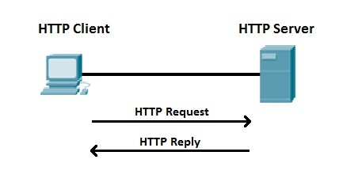
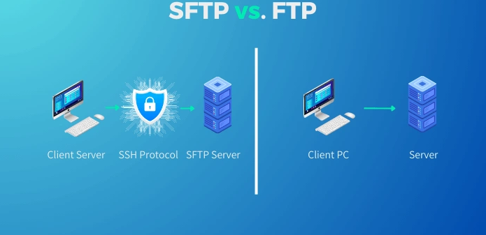
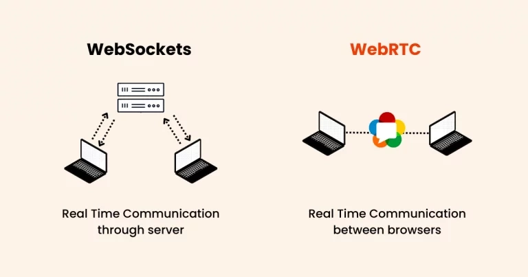
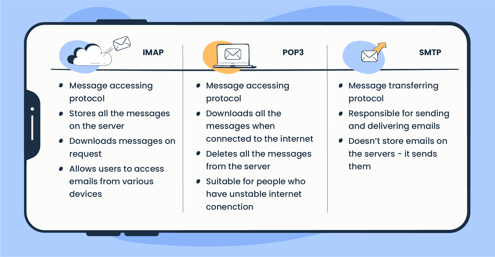
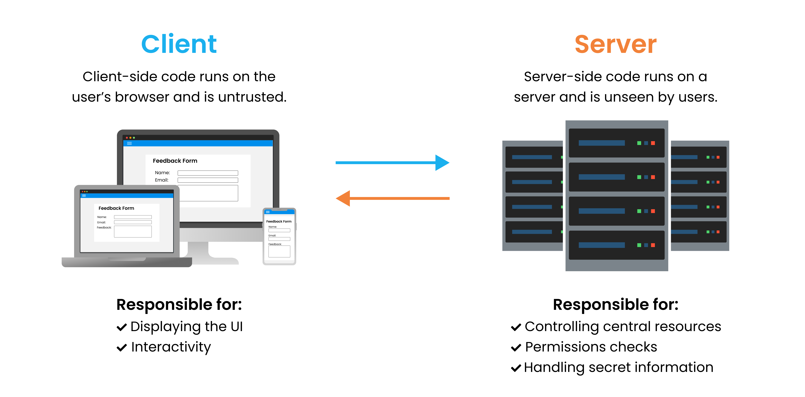

## Objectives
- Introduction To The Web
- Client-Side vs Server-Side
- Types of Requests and Responses
## Introduction To The Web
### Introduction
The **World Wide Web** (commonly known as the **Web**) is a vast network of interconnected documents and resources, accessible via the internet. It allows users to browse websites, share information, communicate, shop, learn, and much more—all through a simple interface powered by web browsers like Chrome, Firefox, or Safari.  
The Web was invented in **1989** by **Sir Tim Berners-Lee**, a British scientist working at **CERN** (the European Organization for Nuclear Research). His goal was to create a system to help scientists share research data more efficiently.
- **1991**: The first website (info.cern.ch) went live, explaining the World Wide Web project.
- **1993**: CERN made the Web technology **open and free** for everyone, leading to rapid growth.
- **1990s**: The first web browsers (like **Mosaic** and later **Netscape**) made the Web user-friendly.
- **Late 1990s - Early 2000s**: The **Dot-com boom** saw the rise of major websites like Google (1998), Amazon, and eBay.
- **2000s - Present**: The Web evolved into **Web 2.0** (interactive, social media-driven) and now moves toward **Web3** (decentralized, blockchain-based).
### Web Protocols
When devices connect over the internet, they follow standardized **web protocols**—sets of rules that define how data is formatted, transmitted, and received. These protocols ensure seamless and secure communication between clients (like your laptop or phone) and servers (where websites and apps are hosted).
#### Internet Protocol
An IP (Internet Protocol) address represents a unique identifier assigned to every device connected to a network, serving as its "digital fingerprint" in the online world. Much like a physical home address ensures mail reaches the right destination, an IP address enables devices to locate and communicate with each other across the vast internet infrastructure.  
IPv4 (Internet Protocol version 4) and IPv6 (version 6) are the two main protocols used to identify devices on networks. IPv4, the older standard, uses 32-bit addresses (like `192.168.1.1`), offering about 4.3 billion possible combinations—a number now insufficient for our connected world. IPv6, its modern successor, employs 128-bit addresses (like `2001:0db8:85a3::8a2e:0370:7334`), providing an almost limitless pool of addresses (340 undecillion) to accommodate the growing Internet of Things.
#### HTTP/HTTPS Protocol
HTTP (Hypertext Transfer Protocol) and its secure version HTTPS serve as the foundational protocols that facilitate our online communications. These protocols enable our browsers to request and receive web content by defining how our devices exchange information across the Internet. When we visit websites, our browsers send HTTP requests to servers, which process these requests and return responses containing the data needed to display web pages. The secure HTTPS version enhances our protection by adding SSL/TLS encryption, safeguarding sensitive information like login credentials and payment details from potential interception. We can identify this security through the padlock icon in our browsers, with HTTPS operating on port 443 instead of HTTP's port 80. Today, HTTPS has become the web standard we all rely on, providing improved security, better search visibility (as search engines prioritize secure sites), and protection against data manipulation during transmission—particularly crucial for sensitive activities like online banking. This evolution from HTTP to HTTPS represents our collective progress toward a more secure and private Internet experience for everyone.

#### FTP/SFTP Protocol
FTP (File Transfer Protocol) and its secure counterpart SFTP (SSH File Transfer Protocol) serve as essential protocols for our file transfer operations. These systems enable us to move files between local devices and remote servers while offering different levels of security protection. When we need to upload website content or download documents, our systems typically use FTP, which establishes connections through port 21 - though we should note this traditional method transmits our data without encryption.  
For our more sensitive file transfer requirements, we employ SFTP, which operates through the secure SSH (Secure Shell) protocol on port 22. This implementation encrypts all our transmission data, including usernames, passwords, and file contents, providing crucial protection for our confidential information. Many professionals in web development and system administration prefer SFTP as it combines familiar FTP functionality with enterprise-grade security measures.  

#### SCP Protocol
SCP (Secure Copy Protocol) is another essential protocol that helps us transfer files securely between systems. Building on SSH encryption, it gives us a fast and secure way to move files using simple command-line operations. Unlike regular FTP, SCP protects both our login credentials and file contents during transfer, making it one of our most trusted tools for sensitive data transfers.  
What makes SCP particularly useful for our work is its perfect balance of security and simplicity. We can easily transfer individual files or entire directories while maintaining strong encryption through SSH. Many of us prefer SCP when we need quick, secure transfers between servers or from remote machines to our local systems.
#### Real-Time Communication Protocol
When we need real-time communication with servers or other clients, we typically rely on two powerful protocols: WebSocket and WebRTC. Each serves distinct purposes in our applications while enabling seamless, instantaneous data exchange.
**WebSocket** gives us persistent, full-duplex communication channels between clients and servers. This protocol is particularly useful when we need:
- Continuous chat applications
- Live notifications and updates
- Real-time collaborative tools
- Instant data synchronization   

What makes WebSocket special is its ability to maintain an open connection after the initial handshake, allowing servers to push data to clients without repeated HTTP requests. We implement it using a simple API (`new WebSocket()`) and typically use it over port 80 or 443 (for secure WS connections).  
**WebRTC** (Web Real-Time Communication) provides us with peer-to-peer media streaming capabilities. We commonly use it for:
- Video conferencing applications
- Voice-over-IP services
- Direct file sharing between browsers
- Low-latency screen sharing  

The strength of WebRTC lies in its ability to establish direct connections between browsers while handling NAT traversal and network complexities automatically. We often combine it with signaling servers (which frequently use WebSocket) to coordinate the connection setup.  

#### Email Communication Protocols (SMTP, IMAP, POP3)
When we need to send and receive emails, we rely on three core protocols that work together to manage our electronic correspondence. Each protocol serves a specific purpose in the email delivery process.
**SMTP** (Simple Mail Transfer Protocol) is our primary protocol for sending emails. We use it when we need:
- Composing and sending new messages
- Forwarding emails to other servers
- Handling outgoing mail between mail servers  
    SMTP typically operates on port 25 (or 587 for secure submission), and it's responsible for the entire journey of our messages from sender to recipient.  

**IMAP** (Internet Message Access Protocol) gives us advanced email management capabilities. We benefit from IMAP when we need:
- Synchronized access across multiple devices
- Server-side folder organization
- Selective message downloading
- Online email management  
    Using port 143 (or 993 for SSL/TLS), IMAP keeps our emails stored on the server while allowing us to access them from anywhere.  

**POP3** (Post Office Protocol version 3) offers us a simpler approach for email retrieval. We typically choose POP3 for:
- Downloading emails to a single device
- Local storage of messages
- Offline access to mail  
    Operating on port 110 (or 995 for secure connections), POP3 downloads messages to our local machine and usually removes them from the server.  

#### Domain Resolution Protocol (DNS)
DNS (Domain Name System) is one of the most critical protocols powering our web experience. Every time we use our browsers to visit websites like Facebook or Google, we're relying on DNS to make these connections possible. This essential system works behind the scenes to translate the human-friendly website names we know into machine-readable IP addresses that computers use to locate servers.  
Without DNS, we'd have to remember and type complex IP addresses for every website we want to visit - making our web experience much more difficult. This "phonebook of the internet" remains one of the most vital yet invisible protocols we depend on every day.
### Web Servers
Web servers are powerful, specialized computers designed to remain permanently online and accessible through the internet.
At their core, web servers perform two vital functions that make the modern web possible. First, they securely store and organize all the components that comprise websites - from the basic HTML documents that structure pages to the CSS files that control their appearance, from JavaScript that enables interactivity to multimedia elements like images and videos. Second, they efficiently process and respond to the countless requests generated by users around the world.  
The process begins when we type a web address or click a link. Our browser automatically formulates a properly structured HTTP or HTTPS request and sends it across the internet to the appropriate server. Upon receiving this request, the server springs into action - identifying the needed resources, retrieving them from storage, and packaging them into a response. This response travels back through the network to our device, where our browser interprets the data and renders it as the visual webpage we interact with.  

### Web Browsers:
Web browsers are specialized software applications that serve as our primary tool for accessing and navigating the World Wide Web. These powerful programs perform several essential functions:
1. **Information Retrieval**: Browsers fetch and display web content from servers across the internet, allowing users to search for and access information from millions of websites.
2. **Structured Presentation**: They render web pages in a visually organized manner by interpreting HTML code, CSS styling, and JavaScript functionality, transforming raw data into user-friendly interfaces.
3. **Navigation Tools**: Modern browsers provide intuitive features like:
    - Tabbed browsing for multitasking
    - Bookmarks for saving favorite sites
    - History tracking for revisiting pages
    - Download management for saving files
4. **Universal Access**: Browsers can display various content types including:
    - Text documents and articles
    - Images, videos, and multimedia
    - Interactive web applications
    - PDFs and other document formats  

Popular examples include Google Chrome, Mozilla Firefox, Apple Safari, and Microsoft Edge, each offering unique features while performing these core functions. Modern browsers also prioritize security with features like phishing protection, automatic updates, and sandboxing to isolate potentially harmful content.
### Search Engine
The web is a wild, ever-expanding space, and we can’t possibly memorize every website or piece of information. When we need to find something whether it’s an app, the latest news, or answers to our questions we rely on **search engines** to guide us.
Search engines like Google, Bing, and DuckDuckGo act as our digital librarians, scanning billions of web pages to deliver the most relevant results. Here’s how they help us:
1. **Crawling** – Automated bots (called "spiders") explore the web, discovering and indexing pages.
2. **Indexing** – They organize and store this data in massive databases for quick retrieval.
3. **Ranking** – When we search, complex algorithms analyze factors like relevance, quality, and popularity to rank results.
4. **Delivering Answers** – In seconds, we get a list of links, images, videos, or even instant answers (like weather or sports scores).

## Client-Side vs Server-Side
### Client-Side
**Client-side** refers to all operations that occur on a user's device (such as a smartphone, tablet, or computer) when interacting with a website or web application. This includes how content is processed, displayed, and interacted with directly in the **web browser** or app interface, minimizing the need for constant back-and-forth communication with remote servers.  
The development of the client side is known as **front-end development**, and it primarily relies on three core technologies:
#### HTML (HyperText Markup Language)
HTML defines the structure and content of a webpage by organizing and structuring various elements such as headings, paragraphs, images, and buttons, essentially serving as the backbone that determines how information is arranged and presented to users
#### CSS (Cascading Style Sheets)
CSS controls the visual presentation of HTML elements by managing their layout, colors, fonts, and responsive behavior, essentially determining how content appears to users. It works by applying style rules to HTML elements, enabling developers to create visually appealing and well-structured designs that adapt to different screen sizes and devices
#### JavaScript
JavaScript brings web pages to life by adding interactivity, logic, and dynamic behavior that transforms static content into engaging experiences. This versatile programming language enables developers to implement features like smooth animations that enhance visual appeal, real-time form validation that improves user input accuracy, and dynamic content updates that refresh information without requiring page reloads.
### Slient-Side
**Server-side** refers to all operations that occur on remote servers when processing requests from client devices (like smartphones, tablets, or computers). This includes handling data storage, business logic, authentication, and other backend processes before sending responses back to the client. Unlike client-side operations that run in browsers, server-side execution happens entirely on web servers, ensuring secure and efficient data management.  
The development of the server side is known as **back-end development**, and it primarily relies on the following core components:
#### Server (Hardware/Software)
Servers provide the computing power and infrastructure needed to process client requests, manage databases, and host applications. They handle high workloads through optimized hardware (multi-core processors, SSDs) and software (web servers like Apache, Nginx).
#### Backend Programming Languages
Languages like Python, PHP, Java, and Node.js execute server-side logic. They process data, interact with databases, and generate dynamic content before sending it to the client
#### Databases
Systems like MySQL, PostgreSQL, and MongoDB store, retrieve, and manage application data securely. They handle structured (SQL) or unstructured (NoSQL) data, ensuring efficient querying and transactions.
#### APIs (Application Programming Interfaces)
APIs act as intermediaries, allowing servers to communicate with other services (e.g., payment gateways, weather data). RESTful or GraphQL APIs standardize data exchange formats (JSON/XML).

## Requests and Responses
### Introduction
We've learned that the web consists of interconnected devices communicating through standardized protocols, and that we use browsers to find applications and interact with them. Now, let's explore the different **types of requests** browsers send to servers to retrieve data, along with the **responses** they receive in return.  
This request-response cycle powers every web interaction, from loading simple pages to processing complex transactions.
### Type of Requests
#### GET Request
A **GET request** is one of the fundamental HTTP methods we use to **retrieve data** from servers. When we enter a URL in our browser or click a link, we're typically sending a GET request to fetch webpage content, images, or API data.
#### POST Request
A **POST request** is the HTTP method we use when we need to **send data** to a server, typically to create or update resources. Unlike GET requests, POST sends data securely in the request body rather than the URL, making it ideal for forms, file uploads, and sensitive operations.
#### PUT Request
A **PUT request** is the HTTP method we use when we need to **fully update or replace existing resources** on a server. Unlike POST (which creates new resources), PUT lets us modify entire records by sending complete updated versions of the data.
#### DELETE Request
A **DELETE request** is the HTTP method we use when we need to **remove existing resources** from a server. This powerful operation lets us permanently delete data records, files, or other server-hosted content when they're no longer needed.
### Types of Responses
#### 200 OK (Success Response)
A **200 OK** response indicates that our request was successfully processed by the server. This is the standard response for successful GET requests and other operations where the server has fulfilled our request as expected.
#### 201 Created (Resource Successfully Added)
A **201 Created** response confirms that our POST or PUT request successfully created a new resource on the server. The response typically includes the location of the newly created resource in the headers.
#### 204 No Content (Successful but Empty Response)
A **204 No Content** response means our request was successful, but the server has no additional data to send back. This is common after DELETE requests or updates that don’t require confirmation.
#### 400 Bad Request (Client-Side Error)

A **400 Bad Request** response tells us that the server couldn’t process our request due to invalid syntax or missing parameters. This usually means we need to correct our input data.
#### 401 Unauthorized (Authentication Required)
A **401 Unauthorized** response means our request lacks valid authentication credentials. The server expects us to log in or provide an API key before proceeding.
#### 403 Forbidden (Access Denied)

A **403 Forbidden** response indicates that while we might be authenticated, we don’t have permission to access or modify the requested resource.
#### 404 Not Found (Resource Missing)
A **404 Not Found** response means the server couldn’t locate the resource we requested. This could happen if we use an incorrect URL or the data has been deleted.
#### 500 Internal Server Error (Server Failure)
A **500 Internal Server Error** means something went wrong on the server’s end while processing our request. This is a generic error when the server encounters an unexpected condition.