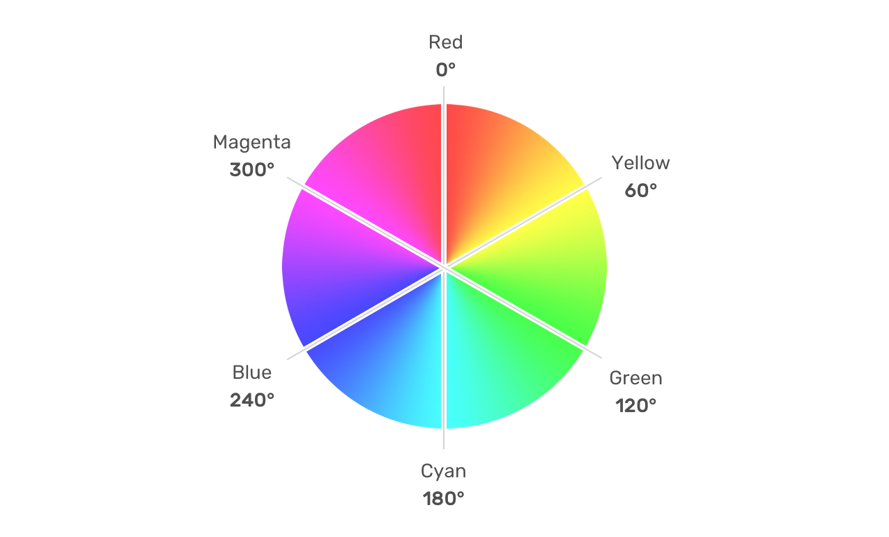
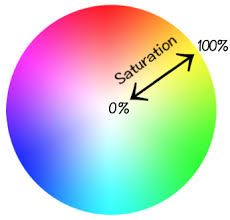
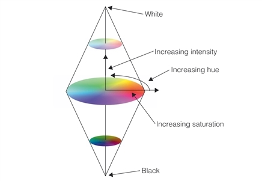

## Objectives:
- Introduction to CSS
- Css Units and Colors
- Styling Texts
- Containers and the Box Model
## CSS:
### Introduction:
**CSS**, or **Cascading Style Sheets**, is the second core language in web development. As its name suggests, CSS focuses on styling web pages and enhancing their visual presentation. With CSS, we can change text colors, modify element backgrounds, add shadows, create animations, and implement many other amazing design features that are not possible with HTML alone.
### Adding CSS to an HTML Page
There are three ways to add CSS to our web page:
#### Inline CSS
With this method, we add the `style` attribute directly to the HTML tag we want to style. Inside the attribute, we write the CSS styles.
```
<p style="color: blue; font-size: 16px;">This is a styled paragraph.</p>
```
#### Internal CSS
We use internal styling by adding a `<style>` tag within the `<head>` section of our HTML document. Inside the `<style>` tag, we write our CSS rules.
```
<head>
    <style>
        p {
            color: blue;
            font-size: 16px;
        }
    </style>
</head>
```
#### External CSS
External styling involves creating a separate CSS file (e.g., `styles.css`) and writing all the styles inside it. We then link this file to our HTML document using the `<link>` tag in the `<head>` section.
```
<head>
    <link rel="stylesheet" href="styles.css">
</head>
```
### Structure of CSS Code
CSS code follows a specific structure. First, we start with a **selector**, which defines the HTML element(s) we want to style. After the selector, we use curly braces `{}`. Inside the braces, we write the **properties** we want to change, followed by a colon `:`, and then the **value** for that property. Each line of CSS is closed with a semicolon `;`.
```
p {
    color: blue;
    font-size: 16px;
}
```

This code changes the text color and font size of all the paragraphs on our page
### Selctors:
CSS provides three basic ways to select elements:
#### Element Selector
We can select elements to style by using their **tag name**. This method will apply the styles to all elements that share the same tag name.
```
p {
    color: blue;
    font-size: 16px;
}
```
#### Class Selector:
We can use the **class value** assigned to an HTML element to select and style it using a **class selector**. To select an element by its class, we start with a `.` (dot) followed by the class name
```
.black_text {
    color:black;
}
```
#### ID Selector:
The last main selector is the **ID selector**. We use this when we want to select an element by its `id` value. To select an element by its ID, we start with a `#` (hash) followed by the ID value.
```
#header {
    font-size: 24px;
    color: darkblue;
}
```
### CSS Specificity and the Cascade
We’ve seen that there are multiple ways to add styles to our pages: **inline**, **internal**, and **external** styles. We’ve also explored different ways to select elements, such as using the **element selector**, **class selector**, or **ID selector**. But what happens in scenarios where an element is targeted by multiple selectors, such as by both its class and ID? Or what if we use inline, internal, and external styles that all target the same element?   
In such cases, CSS follows a set of rules called **specificity** and the **cascade** to determine which styles are applied. Here’s how it works:
#### Specificity:
- ID selectors (`#id`) have higher specificity than class selectors (`.class`), and class selectors have higher specificity than element selectors (`p`, `div`, etc.).
- Inline styles (added directly to an HTML element using the `style` attribute) have the highest specificity.
#### Cascade:
- If two rules have the same specificity, the one that appears **last** in the CSS file or `<style>` tag takes precedence.
### Comments
**Comments** are lines of code that are ignored by the browser, but they are incredibly helpful for developers. They allow us to add hints, explanations, or small reminders about the code we’re writing. In CSS, we create comments by wrapping the text between `/*` and `*/`.
```
/* This is a comment */
p {
    color: blue; /* Change the text color to blue */
    font-size: 16px; /* Set the font size to 16 pixels */
}
```
## Colors and Units
### Colors
Some properties in CSS are used to change the color of text or the background of elements. CSS provides several ways to set color values, offering flexibility and precision in design.
#### Color Names:
We can set the color value in CSS by using **color names**. CSS supports a wide range of predefined color names, such as `white`, `black`, `red`, `blue`, `green`, and many more. These names are easy to use and understand, making them a convenient option for basic color styling.
```
p {
color:black;
}
```
#### RGB and RGBA
We can use the **`rgb()` function** to set colors in CSS. RGB stands for **Red, Green, and Blue**. All colors that exist in nature can be created by mixing these three primary colors in specific amounts. Each color value (red, green, and blue) can range from `0` to `255`, where:
- `0` means no intensity of that color.
- `255` means full intensity of that color.
```
p {
color:rgb(255,0,0); /* pure red*/
}
```
The **`rgba()` function** works similarly to `rgb()`, but it includes an additional value to set the **opacity** of the color. The opacity value, also known as the **alpha channel**, ranges from `0` to `1`:  

- `0` means the color is fully transparent (invisible).
- `1` means the color is fully opaque (no transparency).
```
p {
    color: rgba(0, 0, 255, 0.3); /* Lightly transparent blue */
}
```
#### Hexadecimal Values
Another way to set colors in CSS is by using **hexadecimal values**. Hexadecimal (or hex) colors work similarly to RGB, but the values for red, green, and blue are combined into a single code that starts with a `#`. The hex code is structured as follows:  

- The first two characters represent the **red** value.
- The next two characters represent the **green** value.
- The last two characters represent the **blue** value.

Each pair of characters is a hexadecimal number ranging from `00` to `FF`, where:

- `00` means no intensity of that color.
- `FF` means full intensity of that color.
```
p {
color:#ff0000; /* pure red*/
}

```
#### HSL/HSLA Values
The last way to set colors in CSS is by using the **`hsl()` function**. HSL stands for **Hue, Saturation, and Lightness**, and it provides a more intuitive way to define colors compared to RGB or hexadecimal values. Here’s how it works:
- **Hue**: Represents the color itself, specified as an angle between `0` and `360` on the color wheel.
    - `0` or `360` is red.
    - `120` is green.
    - `240` is blue.

  
  


- **Saturation**: Represents the intensity of the color, specified as a percentage.
    - `0%` is grayscale.
    - `100%` is fully saturated (vivid color).  
    
    

- **Lightness**: Represents the brightness of the color, specified as a percentage.
    - `0%` is black.
    - `50%` is the normal color.
    - `100%` is white.

  
```
h1 {
    color: hsl(0, 100%, 50%); /* Pure red */
}
```

The **`hsla()` function** works similarly to `hsl()`, but it introduces an additional parameter called **alpha**, which represents the **opacity** of the color. The alpha value ranges from `0` to `1`: 

- `0` means the color is fully transparent (invisible).
- `1` means the color is fully opaque (no transparency).
```
p {
    color: hsla(240, 100%, 50%, 0.3); /* Lightly transparent blue */
}
```
#### Tools to set Colors:
There are many online tools that can help us when setting colors for our projects. These tools make it easy to select, customize, and convert colors into different formats like HEX, RGB, or HSL. Here are some popular ones you can use: 

1. **Adobe Color:** [color.adobe.com](https://color.adobe.com/)
	Adobe Color is a powerful tool that allows us to create beautiful color palettes, explore current color trends, and even test color accessibility.
2. **Coolors:** [coolors.co](https://coolors.co/)
	Coolors is a fast and easy-to-use tool for generating color palettes. With just a press of the spacebar, we can create new color combinations and lock the colors we like.
3. **HTML Color Codes:** [htmlcolorcodes.com](https://htmlcolorcodes.com/)
	HTML Color Codes is a beginner-friendly tool that offers a color picker, tutorials, and pre-made color palettes. It’s a great resource for learning about colors and how to use them effectively in our projects.
4. **Color Hunt:** [colorhunt.co](https://colorhunt.co/)
	Color Hunt is a fantastic tool for discovering modern and stylish color combinations. We can browse trending color palettes, save our favorites, and even submit our own creations.
5. **ColorZilla:** [colorzilla.com](https://www.colorzilla.com/)
	ColorZilla is a browser extension that allows us to pick colors directly from any webpage. It’s incredibly convenient for extracting colors from existing designs or websites.
6. **Paletton:** [paletton.com](https://paletton.com/)
	Paletton is a tool that helps us create color schemes based on color theory principles. It’s excellent for designing balanced and professional color palettes.
### Units:
When we style elements, we often need to specify properties like **width**, **height**, or **font size**. To do this, CSS provides us with special **units** to set numeric values. These units allow us to define sizes and distances in a way that suits our design needs.
#### Absolute Unites:
**Absolute units** are used when we want a value to remain fixed and stay the same, regardless of the device or screen size.  

1. **Pixels (`px`)** Pixels are the most commonly used absolute unit. They provide precise control over sizing and are widely supported.  
```
div {
    width: 300px; /* Fixed width of 300 pixels */
}
```
2. **Points (`pt`):** Points are traditionally used in print media and are less common in web design. One point is equal to 1/72 of an inch.
```
h1 {
    font-size: 24pt;
}
```
3. **Inches (`in`), Centimeters (`cm`), and Millimeters (`mm`)**: These units are based on physical measurements and are typically used for print styles or specific design requirements.
```
.print-page {
    width: 8.5in;
    height: 11in; 
}
```
#### Relative Unites:
Unlike absolute units, we use **relative units** when we want the size or value to change dynamically based on factors like the screen size or the size of a parent element. Relative units are essential for creating flexible and responsive designs that adapt to different devices and layouts. Here are some common relative units:  

1. **Percentages (`%`):** Percentages are relative to the size of the parent element. For example, if we set an element’s width to `50%`, it will take up half of its parent’s width.  
```
div {
    width: 50%; 
}
```
 2. **Ems (`em`):** Ems are relative to the font size of the element or its parent. If we set a font size to `1.5em`, it will be 1.5 times the current font size.  
```
p {
    font-size: 1.5em; 
}
```
 3. **Rems (`rem`):** Rems are relative to the root element’s font size (usually the `<html>` element). This makes them consistent across the entire document.  
```
h1 {
    font-size: 2rem; 
}
```
4. **Viewport Units (`vw`, `vh`, `vmin`, `vmax`):** Viewport units are relative to the size of the browser’s viewport:
	- `1vw` = 1% of the viewport width.
	- `1vh` = 1% of the viewport height.
	- `vmin` and `vmax` are based on the smaller or larger dimension of the viewport, respectively.
```
section {
    width: 100vw; /* 100% of the viewport width */
    height: 50vh; /* 50% of the viewport height */
}
```
## Styling Texts
### Introduction
We’ve seen how to add CSS to our HTML page. Now, it’s time to start applying some styles! CSS offers a wide range of properties to style text, allowing us to create visually appealing and readable content
### Text Styling:
#### Text Color:
We can change the color of text using the `color` property. The value can be a color name, HEX code, RGB, or HSL value.
```
p {
    color: #000ff;
}
```
#### Text Alignement
We use the `text-align` property to change the horizontal alignment of text. It can align text to the `left`, `right`, `center`, or `justify` (spacing out text to fill the container).
```
h1 {
    text-align: center;
}
```
We can use the **`vertical-align`** property in CSS to align text or inline elements vertically within their container.It accepts various values, such as:  

- **`baseline`**: Aligns the element with the baseline of the parent (default).
- **`top`**: Aligns the element to the top of the line.
- **`middle`**: Aligns the element to the middle of the line.
- **`bottom`**: Aligns the element to the bottom of the line.
- **`sub`**: Aligns the element as subscript.
- **`super`**: Aligns the element as superscript.
- **`text-top`**: Aligns the element to the top of the parent’s font.
- **`text-bottom`**: Aligns the element to the bottom of the parent’s font.
```
sup {
    vertical-align: super; 
}

sub {
    vertical-align: sub; 
}
```
#### Text Decoration
The `text-decoration` property allows us to add decorative lines to text, such as `underline`, `overline`, `line-through`, or `none` (to remove decorations).
```
.strike {
    text-decoration: line-through;
}
```
We can add **color**, **style**, and **width** to lines (such as borders or outlines) to gain more control over their decoration and appearance.
```
p {  
	text-decoration: underline red double 5px;
}
```
#### Text Transformation
With CSS, **we** can control the case of characters in a paragraph or text element. Using the `text-transform` property, **we** can transform all characters to **uppercase**, **lowercase**, or **capitalize** the first letter of each word.
```
p{
text-transform: lowercase;
}
```
#### Text Spacing
We use **text spacing properties** in CSS to control how spacing works within our text. These properties allow **us** to adjust the spacing between characters, words, and lines, ensuring our text is readable and visually appealing.    

The `line-height` property controls the spacing between lines of text. It can be set as a unitless number (e.g., `1.5`), a fixed value (e.g., `24px`), or a percentage.
```
p {
    line-height: 1.6;
}
```
**`letter-spacing`** property controls the spacing between letters of text.
```
p {
    letter-spacing: 2px;
}
```
**`word-spacing`**: property controls the spacing between words.
```
p {
    letter-spacing: 4px;
}
```
`text-indent` property is used to specify the indentation of the first line of a text
```
p {  
	text-indent: 50px;
}
```
#### Text Shadow
We can also add a shadow effect to text using the `text-shadow` property in CSS. This property accepts the following values:  

1. **Horizontal offset**: Moves the shadow left (negative value) or right (positive value).
2. **Vertical offset**: Moves the shadow up (negative value) or down (positive value).
3. **Blur radius**: Controls the blurriness of the shadow (optional).
4. **Color**: Defines the color of the shadow (optional).
```
h1 {
  text-shadow: 2px 2px 4px rgba(0, 0, 0, 0.5); 
}
```
If **we** want to add more than one text shadow, we can simply separate each shadow by commas.
```
h1 {
  text-shadow: 1px 1px 2px red, -1px -1px 2px blue;
}
```
### Font Styling
#### Font size:
We can change the font size using the `font-size` property. The value can be specified in various units, such as pixels (`px`), ems (`em`), rems (`rem`), or percentages (`%`).
```
p {
    font-size: 16px;
}
```
#### Font Weight
The `font-weight` property allows us to control the thickness of the text. Common values include `normal`, `bold`, `bolder`, or numeric values like `400` (normal) and `700` (bold).
```
h2 {
    font-weight: bold; 
}

strong {
    font-weight: 700;
}
```
#### Font Family:
We can change the font family using the `font-family` property. It allows us to specify a preferred font and fallback options in case the preferred font is not available. It’s common to end the list with a generic font family like `serif`, `sans-serif`, or `monospace`.
```
/* Uses Arial, falls back to Helvetica, then sans-serif */
body {
    font-family: "Arial", "Helvetica", sans-serif; 
}
```
#### Font Style
The `font-style` property allows us to control the style of the text, such as making it italic or oblique. It’s commonly used to emphasize text or match specific design requirements. Here are the main values for this property:  

1. **Normal** The `normal` value displays text in its default style (not italic or oblique)
```
p {
    font-style: normal; 
}
```
2. **Italic** The `italic` value displays text in an italic style, which is often a slanted version of the font.
```
em {
    font-style: italic;
}
```
3. **Oblique** The `oblique` value also slants the text, but it’s a simulated version of italic. If the font doesn’t have a true italic version, the browser will slant the text artificially.
```
blockquote {
    font-style: oblique; 
}
```
### Styling Lists
CSS allows us to style lists and modify their appearance. For example, we can change the counting format of ordered lists (`<ol>`) to use different numbering systems, such as Roman numerals, letters, or custom formats. Additionally, we can style unordered lists (`<ul>`) by customizing bullet points, using images, or even removing them entirely for a cleaner design.
#### Styling Ordered Lists (`<ol>`)
We can change the numbering format using the `list-style-type` property. For example:
```
ol {
  list-style-type: upper-roman; /* Changes numbers to uppercase Roman numerals */
}
```
Other options include:

- `decimal` (default numbers)
- `lower-alpha` (lowercase letters)
- `upper-alpha` (uppercase letters)
- `lower-roman` (lowercase Roman numerals)

#### Styling Unordered Lists (`<ul>`)
We can customize bullet points or replace them with images:
```
ul {
  list-style-type: square; 
}
ul {
  list-style-type: none; /* Removes bullets */
}
ul {
  list-style-image: url('star.png'); /* Replaces bullets with an image */
}
```
## Containers and the Box Model
### Introduction:
We’ve explored how CSS works and learned how to style text. Now, it’s time to take the next step and style our webpage’s elements and containers.
### Element displays:
We’ve learned that HTML elements can be categorized as **block-level** or **inline** elements. In CSS, we can change the display behavior of these elements using the `display` property. For example, we can turn an inline element into a block-level element, or vice versa. This is achieved by setting the `display` property to values like `block`, `inline`, `inline-block`.
```
span {
  display: block;
}
div {
  display: inline;
}
```
The `inline-block` display property is a unique way to style elements, combining features of both **inline** and **block-level** element  

- **Inline behavior**: Elements sit next to each other horizontally, just like inline elements.
- **Block behavior**: You can define specific dimensions (width and height) and apply spacing (padding and margins).

If **we** want to hide an element, we can set its `display` property to `none`.
### Width and Height:
We can adjust the dimensions of an element using the `width` and `height` properties in CSS.
```
div {
  width: 300px;
  height: 150px;
}
```
### Background:
#### Background Color
We can set or change the background of an element using the `background-color` property in CSS. This property allows us to apply a solid color to the background of any element, such as a `<div>`, `<section>`, or even the entire webpage.
```
.element {
  background-color: #3498db; /* Applies a blue background color */
}
```
#### Background Image:
We can set a background image for an element using the `background-image` property in CSS. This property uses the `url()` function to load an image from a specified file path or URL.
```
body {
  background-image: url('images/background.jpg');
}
```
CSS provides additional properties to give us more control over how a background image is displayed. These properties allow us to fine-tune the appearance and behavior of background images, ensuring they fit seamlessly into the design of a webpage.  

1. **`background-repeat`**: This property specifies how the background image should be repeated to match the size of the element. It accepts the following values:
- **`repeat`**: The image repeats both horizontally and vertically (default behavior).    
- **`no-repeat`**: The image is displayed only once without repeating.
- **`repeat-x`**: The image repeats only horizontally.
- **`repeat-y`**: The image repeats only vertically.
- **`space`**: The image repeats as much as possible without clipping, and the extra space is evenly distributed around the images.
- **`round`**: The image repeats and scales to fit the element without leaving gaps.  


2. `background-position`: This property  specifies the starting position of a background image within an element. It allows you to control where the image is placed. it accept the folowing values

- **Keyword Values**: `top`, `bottom`, `left`, `right`, `center`:
		``background-position: center top;``
- **Percentage Values**: Adjusts the position based on percentages of the element’s size:
        ``background-position: 50% 50%; ``
- **Length Values**: Uses specific units like pixels (`px`), ems (`em`), etc.:
		``background-position: 20px 10px; /* Positions 20px from the left and 10px from the top */``
- **Mixed Values**: Combines keywords, percentages, or lengths:
		``background-position: right 10% bottom 20px; /* Aligns to the right, 10% from the top, and 20px from the bottom */``  


3. `background-size` This property allows **us** to control how a background image is sized within an element. **We** can use it to scale, stretch, or adjust the image to fit or fill the element’s dimensions perfectly.

- **`auto`**: The image retains its original size
- **`cover`**: Scales the image to cover the entire element while maintaining its aspect ratio. Some parts of the image may be cropped.
- **`contain`**: Scales the image to fit entirely within the element while maintaining its aspect ratio. The entire image will be visible, but there may be empty space.
- **Specific Dimensions**: We can specify exact dimensions using units like pixels (`px`), percentages (`%`), etc.
- **Mixed Values**: We can combine values to set width and height independently  

4. **`background-attachment`**: This property   allows **us** to control how a background image behaves when the page is scrolled. It determines whether the background image scrolls with the content or remains fixed in place.

- **`scroll`**: The background image scrolls along with the element
- **`fixed`**: The background image stays fixed relative to the viewport, even when the page is scrolled.
- **`local`**: The background image scrolls with the element’s content, but remains fixed within the element itself.

```
body {
  background-image: url('images/cat.jpg'); 
  background-repeat: no-repeat;
  background-position: center center;
  background-size: cover;
  background-attachment: fixed;
}
```
### Margin and Padding
#### Margin
The `margin` property in CSS allows **us** to create space around an element, separating it from other elements on the page. It adds **external space** outside the element’s border
```
div {
  margin: 20px; 
}
```
We can also specify different margins for each side individually:
```
div {
  margin-top: 10px;
  margin-right: 15px;
  margin-bottom: 20px;
  margin-left: 25px;
}
```
Finally we can use shorthand syntax
```
div {
  margin: 10px 15px 20px 25px; /* top, right, bottom, left */
}
```
#### Padding:
Unlike `margin`, which adds space **outside** an element, we use the `padding` property to add space **inside** the element itself. Padding creates space between the element’s border and its content
```
div {
  padding: 20px;
}
```
We can also specify different padding values for each side individually:
```
div {
  padding-top: 10px;
  padding-right: 15px;
  padding-bottom: 20px;
  padding-left: 25px;
}
```
Finally we can use shorthand syntax
```
div {
  padding: 10px 15px 20px 25px;
}
```
### Borders
CSS also allows **us** to specify and add borders to our elements. We use the `border` property for this purpose. The `border` property accepts three main values:
1. **Width**: The thickness of the border (e.g., `2px`).
2. **Style**: The style of the border (e.g., `solid`, `dashed`, `dotted`).
3. **Color**: The color of the border (e.g., `#000000` or `red`).
```
div {
  border: 2px solid #3498db;
}
```
We can also customize individual sides of the border using properties like `border-top`, `border-right`, `border-bottom`, and `border-left`:
```
div {
  border-top: 3px dashed red;
  border-bottom: 1px solid black; 
}
```
We can also specify a **border radius** to make the corners of an element more rounded. This is achieved using the `border-radius` property in CSS.
```
div {
  border-radius: 10px; /* Rounds all corners by 10px */
}
```
We can also specify different radii for each corner of an element individually
```
border-radius: top-left top-right bottom-right bottom-left;
```
Example
```
div {
  border-radius: 10px 20px 30px 40px; 
}
```
### Box Sizing:
The `box-sizing` property in CSS controls how the total width and height of an element are calculated. By default, an element’s width and height only apply to its content box, excluding padding and border. However, `box-sizing` allows **us** to include padding and border in the element’s dimensions.  
- **`content-box`**: The width and height only include the content. Padding and border are added outside, increasing the element’s total size.
```
div {
  box-sizing: content-box;
  width: 200px;
  padding: 20px;
  border: 5px solid black;
  /* Total width = 200px (content) + 40px (padding) + 10px (border) = 250px */
}
```
- **`border-box`**:The width and height include the content, padding, and border. This makes it easier to manage element sizes, as the total size remains consistent.
```
div {
  box-sizing: border-box;
  width: 200px;
  padding: 20px;
  border: 5px solid black;
  /* Total width = 200px (includes padding and border) */
}
```
### Box Shadow
We can add a shadow to an element using the `box-shadow` property. This property allows us to apply shadow effects, enhancing the element's visual appearance.
The `box-shadow` property accepts five values, separated by spaces
```
box-shadow: [horizontal offset] [vertical offset] [blur radius] [spread radius] [color];
```
1. **Horizontal offset**: Moves the shadow to the left (negative value) or right (positive value).
2. **Vertical offset**: Moves the shadow upward (negative value) or downward (positive value).
3. **Blur radius**: Controls the blurriness of the shadow. A larger value creates a softer, more diffused shadow.
4. **Spread radius**: Expands (positive value) or shrinks (negative value) the size of the shadow.
5. **Color**: Defines the color of the shadow. You can use color names, hex codes, or `rgba()` for transparency.
```
div {
    box-shadow: inset 0 0 10px red;
}
```
We can add more than one shadow to an element by separating different shadow values with commas.
```
div {
    box-shadow: 3px 3px 5px rgba(0, 0, 0, 0.3), -3px -3px 5px rgba(255, 255, 255, 0.3);
}
```
### Opacity
We can control the transparency of an element and determine how visible it is by using the `opacity` property. The `opacity` property accepts a value between **0** and **1**, where:
- **0** means the element is completely transparent (invisible).
- **1** means the element is fully opaque (completely visible).
```
divs {
    opacity: 0.5; /* The element is 50% visible */
}
```
### Styling Tables:
We can use CSS to style our tables. For example, we can use the `border` property to add borders to our tables. To do this, we need to apply borders to the `<table>`, `<tr>`, `<td>`, and `<th>` elements.
```
table, th, td {
    border: 1px solid black;
   
}
```
The issue with this approach is that cells will have double borders. To fix this and make the `border` property behave the same way as the HTML `border` attribute, we can add the `border-collapse` property and set it to `collapse`
```
table, th, td {
    border: 1px solid black;
    border-collapse: collapse; 
}
```
## Task:
### Task 1 :
**Create an HTML file with the following structure:**
- Add a main heading (`<h1>`).
- Write three paragraphs (`<p>`).
- Include a blockquote (`<blockquote>`).
- Add a section (`<section>`) containing a subheading (`<h2>`) and two paragraphs.

**Style the elements using an external CSS file:**
1. **Main Heading (`<h1>`):**
	- Center-align the text.
	- Apply a text shadow: `2px 2px 3px darkgray`.
	- Use a custom font family with fallbacks (e.g., `"Arial", sans-serif`).
	- Set the color using a hex value (e.g., `#333`).
2. **Paragraphs (`<p>`):**
	- **First paragraph:** Set text color to blue using `rgb(0, 0, 255)`.
	- **Second paragraph:** Set text color to `green`, underline it, and customize the underline color (e.g., `text-decoration: underline red`).
	- **Third paragraph:** Set text color using `hsl(270, 100%, 50%)`, line height to `1.6`, and letter spacing to `1px`.
3. **Blockquote (`<blockquote>`):**
	- Style text in italics (`font-style: italic`).
	- Add a `30px` text indent.
	- Set a left border: `3px solid gray`.
	- Apply `15px` padding.
	- Use a semi-transparent background (e.g., `background-color: rgba(0, 0, 0, 0.2)`).
4. **Section (`<section>`):**
	- Apply a background color (e.g., `#f5f5f5`).
	- **Subheading (`<h2>`):** Convert text to uppercase (`text-transform: uppercase`).
	- **Last paragraph:** Indent the first line by `20px` (`text-indent: 20px`).
#### Solution:
You can find our solution here: https://alitigui.github.io/Front_end_solutions/Lecture4/solution1/index.html
### Task 2
**Create an HTML file with the following elements:**
- A header div
- Three card divs inside a container div
- A footer div  

**Style the elements using an external CSS file:**
1. **The header**:
    - Display as block
    - Height of 15vh
    - Width of 100%
    - A background color of your choice
    - Centered text
    - Padding of 20px
2. **The container**:
    - Display as block
    - Width of 90%
    - Margin: 0 auto (to center it)
    - Contains three cards displayed as inline-block
3. **Cards**:
    - Display as inline-block
    - Width of 300px
    - Height of auto
    - Margin of 1em
    - Padding of 20px
    - Border: 2px solid with a color of your choice
    - Border-radius of 10px
    - Box-shadow with your preferred values
    - Set `box-sizing` to `border-box`
    - Add some text content inside each card
    - Vertical-align: top (to align cards properly)
4. **The footer**:
    - Display as block
    - Height of 10vh
    - Width of 100%
    - Background color different from the header
    - Text centered both horizontally and vertically
    - Fixed position at the bottom of the page
#### Solution:
You can find our solution here: https://alitigui.github.io/Front_end_solutions/Lecture4/solution2/index.html
