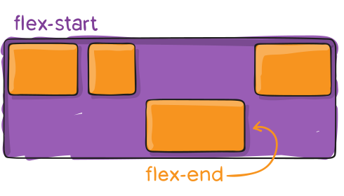

## Objectives:
- Advanced Selectors
- Gradient Colors
- Positioning Elements
- Working with Flexbox
## Advanced Selectors
### Introduction:
CSS is more powerful when it comes to selecting and targeting elements for styling. It provides advanced selectors that allow us to target specific elements with precision. For example, we can select elements by their class, by special attributes they possess, or even by their position in the document. With CSS, we can target the first or last element in a container, the nth element using pseudo-classes like `:first-child`, `:last-child`, and `:nth-child()`, or even select multiple elements at once within a single style block. This flexibility makes CSS an essential tool for creating dynamic and responsive designs.
### Selecting Multiples Element:
We can select multiple elements for a block of styles by separating their selectors with a comma. For example, if we want to set the font size of all `<span>` and `<a>` elements to 18px, we can do the following:
```
span, a{
	font-size:18px;
}
```
### Filter Elements by Class
We learned how to select elements that have a specified class. However, we can create even more powerful selectors to refine our targeting and select only specific elements, rather than selecting all elements that share the same class. For example, to select only paragraphs that have the class `"intro"`.  
```
p.intro {
    text-indent: 20px;
}
```
### Attribute Selectors
We can also select and target elements based on specific attributes they possess, not just by using class attributes. For example, to select all text input elements
```
input[type="text"] {
    border: 1px solid #ccc;
}
```
### Universal selector
We can use the **universal selector (`*`)** to select every element on a web page. For example, to set the text color of all elements to red
```
* {
    color: red;
}
```
### Relative Selector
We can select elements that are children or nested inside other elements in CSS. To achieve this, CSS provides the following methods:
#### Child Selector (`>`)
This will select the direct child that exist inside element
**Example :**  
HTML  
```
<div>
	<section>
		<p>paragraph1</p>
	</section>
	<p>paragraph2</p>
</div>
```
CSS
```
p > div{
colore :red;
}
```
Only **paragraph2** will get styled, and its text color will be changed to red.
#### Descendant Selector (  )
This selects all the children of an element, whether they are direct children or nested deeper within other elements.
**Example :**  
HTML  
```
<div>
	<section>
		<p>paragraph1</p>
	</section>
	<p>paragraph2</p>
</div>
```
CSS
```
p  div{
colore :red;
}
```
Here, **both paragraphs** will be styled, and their text color will change to red.
#### Adjacent Sibling Selector (`+`)
This selects the first element that comes immediately after a specified element.
```
h2 + p {
    margin-top: 0;
}
```
This will set the `margin-top` to `0` for the first paragraph that comes after an `<h2>` tag.
#### General Sibling Selector (`~`)
This selects all elements that are siblings of a specified element and are on the same level in the document hierarchy.  
**Example :**  
HTML  
```
<div>
  <h2>Heading</h2>
  <p>Paragraph 1</p>
  <p>Paragraph 2</p>
  <p>Paragraph 3</p>
</div>
```
CSS
```
h2 ~ p {
  color: blue;
}
```
This will style **all `<p>` elements** that are siblings of the `<h2>` element, changing their text color to blue.
### Negation Selector
We use this selector to select all elements that match our query **except** for a specified one.  
**Example:**  
HTML:
```
<div>
  <p class="intro">Paragraph 1</p>
  <p>Paragraph 2</p>
  <p>Paragraph 3</p>
</div>
```
CSS:
```
p:not(.intro) {
  color: red;
}
```
This will style **all `<p>` elements** except the one with the class `intro`, changing their text color to red.
### Pseudo-Classes
We use **Pseudo-Classes** to select elements based on their state or position on a webpage. For example:
- We can change the color of a link if it has been clicked (`:visited`) or is being hovered over (`:hover`).
- We can change the background or display of an element when a user interacts with it, such as hovering over it (`:hover`) or focusing on it (`:focus`).
- We can also target elements based on their position in a group, such as the first (`:first-child`), last (`:last-child`), or nth element (`:nth-child()`).
#### States
CSS provides us with the following **Pseudo-Classes** to control elements based on their states:
- **`:hover`**: Styles an element when the user hovers over it.
- **`:focus`**: Styles an element when it is in focus (e.g., when a user clicks or types in an input field).
- **`:checked`**: Styles a checkbox or radio button when it is checked by the user.
- **`:visited`**: Changes the style of a link that has been visited.
- **`:active`**: Styles an element while it is being clicked or activated.
- **`:default`**: Styles an element when it is in its default state (e.g., a default button in a form).
- **`:valid`**: Styles a form element when its input is valid.
- **`:invalid`**: Styles a form element when its input is invalid.
```
button:hover {
    background-color: yellow;
}
input:focus {
    border-color: blue;
}
a:visited {
        color: purple;
}

```
#### Positions
We can target and style elements based on their position in the document using the following **pseudo-classes**:
- **`:first-child`**: Selects the first child element within a parent.
- **`:last-child`**: Selects the last child element within a parent.
- **`:nth-child()`**: Selects elements based on their position in a group , the value can be number equation or work (even, odd)
- **`:nth-last-child()`**: Work same as `:nth-child()` but counting start from the last child.
- **`:first-of-type`:** Selects the first element of its type within a parent.
- **`:last-of-type`**: Selects the last element of its type within a parent.
- **`:nth-of-type()`** Selects elements of a specific type based on their position.
- **`:only-child`** : Selects an element if it is the only child of its parent.
- **`:only-of-type`**: Selects an element if it is the only one of its type within its parent.
- **`:empty`**: Selects an element  with no children.
```
li:first-child {
    font-weight: bold;
}

li:last-child {
    color: red;
}

li:nth-child(2) {
    background-color: yellow; 
}

li:nth-child(odd) {
    background-color: #f2f2f2; 
}

p:nth-of-type(3) {
    background-color: lightgray;
}
```
### Pseudo-Elements
We use **Pseudo-Elements** to target and style specific parts of an element, such as the first letter, the first line, or to insert content before or after the element itself.
- **`::first-letter`**: Styles the first letter of an element.
- **`::first-line`**: Styles the first line of an element.
- **`::before`**: Inserts content before the element.
- **`::after`**: Inserts content after the element.
```
p::first-line {
        font-weight: bold;
}
p::before {
        content: "Note: ";
        font-weight: bold;
}
p::after {
        content: " (Read More)";
        color: blue;
}
```
### The :root Selector
The `:root` selector is used to select the root element of the document, which typically represents the `<html>` tag. It is especially useful for creating **CSS variables** (custom properties) that store specific values, such as colors, and sharing them across all elements. By defining variables in the `:root` selector, you only need to change the value once, and it will automatically update all elements that use the variable.  
#### Example:
```
:root {
  --primary-color: #3498db; /* Define a variable */
  --secondary-color: #2ecc71;
}

h1 {
  color: var(--primary-color); /* Use the variable */
}

button {
  background-color: var(--secondary-color);
```
## Gradient 
### Introduction:
CSS provides us with **multiple ways to define and select colors**, such as using the `rgb()` function, `hsl()` function, or hexadecimal values. However, this is not the limit of what CSS can do for styling elements. CSS also allows us to create **color gradients**, which can add more visually interesting and dynamic effects to our designs.  
CSS gradients allow us to create smooth transitions between two or more colors. There are two main types of gradients:
### Linear Gradient
A linear gradient creates a smooth color transition along a straight line. You can specify the direction of the gradient and the colors to be used.
```
background: linear-gradient(direction, color-stop1, color-stop2, ...);
```
The direction of a gradient can be set **implicitly** or **explicitly**. For example:
- We can use keywords like `to right` to specify that the gradient flows from **left to right**.
```
background: linear-gradient(to right, red, yellow); /* Left to right */
background: linear-gradient(to bottom, red, yellow); /* Top to bottom */
background: linear-gradient(to top right, red, yellow); /* Diagonal */
```
- Alternatively, we can use **degrees** (e.g., `45deg`) to specify the direction with more precision and control.
```
background: linear-gradient(45deg, red, yellow); /* 45-degree angle */
background: linear-gradient(180deg, red, yellow); /* Bottom to top */
```
We can use **more than one color** in a gradient. The first color specified will be the **starting color**, and the gradient will transition to the second color, then the third color, and so on.  
**Examples**:
```
div {
	width :200px;
	height:100px;
	background: linear-gradient(45deg, #ff00cc, #333399);
}

```
**Output:**   
    
```
div { 
width :400px; 
height:400px; 
background:linear-gradient(45deg, #ff9a9e, #fad0c4, #fbc2eb, #a6c1ee, #84fab0, #8fd3f4); 
}
```
**Output:**  
  

### Radial Gradient
Radial gradients work similarly to linear gradients, but we have additional parameters that allow **us** to control the **shape** and **size** of the gradient. This means we’re not limited to just linear gradients we can create circular or elliptical gradients for more dynamic effects.
1. Shape:
	- `circle` Creates a gradient in the shape of a perfect circle.
	- `ellipse` Creates a gradient in the shape of an ellipse (oval). This is the **default shape** if no shape is specified.
2. Size:
	- **`closest-side`**: The gradient ends at the side closest to the center.
	- **`farthest-side`**: The gradient ends at the side farthest from the center.
	- **`closest-corner`**: The gradient ends at the corner closest to the center.
	- **`farthest-corner`**: The gradient ends at the corner farthest from the center (default).
3. Position:
		- We can use directional keywords to position the gradient's center: **`top`**, **`bottom`**, **`left`**,  **`right`**, **`center`**
		- We can use percentages to position the gradient's center relative to the element's dimensions
			- **`0% 0%`**: Top-left corner.
			- **`50% 50%`**: Center (default).
			- **`100% 100%`**: Bottom-right corner.
		- We can use absolute units like `px`, `em`, or `rem` to position the gradient's center
			- **`50px 100px`**: Positions the gradient 50px from the left and 100px from the top.

**Examples:**  
```
div { 
	width :400px; 
	height:400px; 
	background: radial-gradient(circle at bottom, #ff7e5f, #feb47b, #8fd3f4);
}
```
**Outputs:**  
  

```  
div { 
	width :400px; 
	height:400px; 
	background: radial-gradient(circle at 30% 30%, #ffffff, #cccccc, #666666, #333333);
}
```
**Outputs:**  
   

### Repeating gradients
Repeating gradients in CSS allow **us** to create patterns by repeating a gradient at regular intervals. This is particularly useful for creating **stripes**, **checkerboards**, or other **patterned backgrounds**. 
#### ``repeating-linear-gradient``: 
This creates a linear gradient that repeats along a straight line.
```
div { 
	width :400px; 
	height:400px; 
	background: repeating-linear-gradient( 45deg, #333, #333 10px, #fff 10px, #fff 20px );
}
```
**Output:**  
  

**Explanation :**
We set the **angle** to `45deg`, then define the first color as `#333` (gray), which starts at position `0` and stops at `10px`. After this, we set the second color as `#fff` (white), starting at `10px` and stopping at `20px`. With this setup, our gradient will **repeat this pattern** until the end of the element.
#### **``repeating-radial-gradient``**: 
This creates a gradient that repeats outward from a central point.
```
div { 
	width :400px; 
	height:400px; 
	background: repeating-radial-gradient( circle, black, black 1%, white 1%, white 2% );
}
```
**Output:**  
  

**Explanation :**  
We set the **shape** to `circle`, which creates concentric circles. Then, we define the first color as `black`, which starts at position `0%` and stops at `1%`. After this, we set the second color as `white`, starting at `1%` and stopping at `2%`. With this setup, our gradient will **repeat this pattern** every **20%**, creating a target pattern until the end of the element.
## Positioning Elements
### Introduction
When creating our page layout, we need more than just styling text, setting colors, and adjusting backgrounds. We also need precise control over the positioning of elements. CSS provides a high level of flexibility when it comes to positioning elements and building effective page layouts.  
To position an element, we first use the `position` property to define how the element should be positioned within the document. After setting the `position` property, we can use the `top`, `bottom`, `left`, and `right` properties to specify the exact location or offset of the element relative to its containing block or viewport.
### `position` property
The **`position` property** in CSS is used to define how an element is positioned within a document. It determines the positioning behavior of an element and serves as the foundation for controlling its placement,This property accepts the following values:
#### **`static`**:
**`static`** is the default value of the `position` property. It means the element will be positioned according to its natural placement in the HTML document flow, following the order in which it appears in the code. If we set the position to `static`, the properties `top`, `bottom`, `left`, and `right` will **not have any effect** on the element.
#### **`relative`**
We use **`relative`** to position an element relative to its original position in the document flow. This means that if we set a value for the `top` property, the element will be pushed downward by that specified value, using `relative` positioning **does not affect the document flow** the original space reserved for the element remains unchanged, as if the element were still in its initial position.  
**Example:**  
**HTML**
```
<div class="container">
  <div class="box box1">Box 1</div>
  <div class="box box2">Box 2</div>
  <div class="box box3">Box 3</div>
</div>
```
**CSS**
```
.container {
  border: 2px solid black;
  padding: 20px;
}

.box {
  width: 100px;
  height: 100px;
  color: white;
  text-align: center;
  line-height: 100px;
}

.box1 {
  background-color: red;
}
.box2 {
  background-color: green;
  position: relative; 
  top: 20px; /* Push 20px from the top */
  left: 30px; /* Push 30px from the left */
}

.box3 {
  background-color: blue;
}
```
**Output**  
  

#### **`absolute`**
The **`absolute`** value is used to give an element an absolute position. It removes the element from the normal document flow, meaning its original space is no longer reserved. The element is then positioned based on the values of the `top`, `bottom`, `left`, and `right` properties, relative to its nearest positioned ancestor (an ancestor with a `position` value other than `static`). If no such ancestor exists, it will be positioned relative to the initial containing block (usually the viewport).  
**Example:**  
**HTML**  
```
<div class="container">
  <div class="box box1">Box 1</div>
  <div class="box box2">Box 2</div>
  <div class="box box3">Box 3</div>
</div>
```
**CSS**  
```
.container {
  position: relative;
  border: 2px solid black;
  padding: 20px;
  height: 200px;
}

.box {
  width: 100px;
  height: 100px;
  color: white;
  text-align: center;
  line-height: 100px;
}

.box1 {
  background-color: red;
}

.box2 {
  background-color: green;
  position: absolute; /* Absolute positioning */
  top: 50px; /* 50px from the top of the container */
  left: 50px; /* 30px from the left of the container */
}

.box3 {
  background-color: blue;
}
```
**Ouput:**  
  

**Explanation:**  
Box 1 and Box 3 remain in their original positions within the document flow, unaffected by any changes to Box 2. Box 2, however, is removed from the document flow, meaning its original space is no longer reserved. Instead, it is positioned **20px from the top** and **30px from the left** of the `.container` element. This positioning is possible because `.container` has `position: relative`, making it the reference point for Box 2's placement. If `.container` did not have `position: relative`, Box 2 would be positioned relative to the viewport instead.
#### `fixed`
Finally, we use **`fixed`** to position an element at a specific place on the screen. The element will remain fixed in that position even when the user scrolls up or down. Like `absolute`, the `fixed` value removes the element from the document flow, meaning its original space is no longer reserved. The element is then positioned using the `top`, `right`, `bottom`, and `left` properties **relative to the viewport**
### ``z-index``
The **`z-index`** is a special property used to control the stacking order of elements when they overlap. The `z-index` property accepts numeric values, and the element with the **higher value** will be displayed on top of elements with lower values.
#### Example:
**HTML**  
```
<div class="container">
  <div class="box box1">Box 1</div>
  <div class="box box2">Box 2</div>
  <div class="box box3">Box 3</div>
</div>
```
**CSS**  
```
.container {
  position: relative;
  border: 2px solid black;
  padding: 20px;
  height: 200px;
}

.box {
  width: 100px;
  height: 100px;
  color: white;
  text-align: center;
  line-height: 100px;
  position: absolute; 
}

.box1 {
  background-color: red;
  top: 20px;
  left: 20px;
  z-index: 1; 
}

.box2 {
  background-color: green;
  top: 50px;
  left: 50px;
  z-index: 2; 
}

.box3 {
  background-color: blue;
  top: 80px;
  left: 80px;
  z-index: 3; 
}
```
**Ouput:**  
  

#### Remark:
**`z-index`** only affects elements with a `position` value other than `static`
## Flexbox

### Introduction
Flexbox is a modern and powerful CSS tool for creating flexible and responsive web page layouts. To use Flexbox, **we** start by defining a container (parent element) and setting its `display` property to `flex`. This turns the container into a **flex container**, and its direct children become **flex items**. Once the container is set up, **we** can easily control the alignment, spacing, and distribution of the child elements using Flexbox properties.
### Container properties
#### `display`:
first thing we need when creating flex box is setting the display to flex
```
.container{
	display:flex;
}
```
#### `flex-direction`
The **`flex-direction`** property controls the direction and flow of items inside a flex container. It accepts the following values:
- **`row`**: Displays items in a row (left to right, default behavior).
- **`row-reverse`**: Displays items in a row but in reverse order (right to left).
- **`column`**: Displays items in a column (top to bottom).
- **`column-reverse`**: Displays items in a column but in reverse order (bottom to top).  
  

#### ``flex-wrap``
The **`flex-wrap`** property determines whether the items inside a flex container will wrap to the next line or if the container will grow to accommodate all items within a single line. It accepts the following values:
- **`nowrap`**: All items are forced into a single line (default behavior).
- **`wrap`**: Items wrap to the next line if they exceed the container's width.
- **`wrap-reverse`**: Items wrap to the next line in reverse order.
#### ``flex-flow``
This is a shorthand for the `flex-direction` and `flex-wrap` properties, which together define the flex container’s main and cross axes.
```
.container { 
	flex-flow: column wrap; 
}
```
#### ``justify-content``
We use the **`justify-content`** property to define how items are aligned inside a flex container. The alignment depends on the **flex direction** (row or column) and controls the distribution of space between and around items. It accepts the following values:
- **`flex-start`**: Items are aligned at the start of the container (default).
- **`flex-end`**: Items are aligned at the end of the container.
- **`center`**: Items are centered within the container.
- **`space-between`**: Items are evenly distributed, with the first item at the start and the last item at the end.
- **`space-around`**: Items are evenly distributed with equal space around them.
- **`space-evenly`**: Items are evenly distributed with equal space between and around them.

  

#### ``align-items``
We use the **`align-items`** property to define how items are aligned **along the cross axis** (perpendicular to the main axis) inside a flex container. This property is especially useful for controlling vertical alignment in rows or horizontal alignment in columns. It accepts the following values:
- **`stretch`**: Items stretch to fill the container (default).
- **`flex-start`**: Items are aligned at the start of the cross axis.
- **`flex-end`**: Items are aligned at the end of the cross axis.
- **`center`**: Items are centered along the cross axis.
- **`baseline`**: Items are aligned based on their text baselines.

  

#### ``align-content``
We use the **`align-content`** property to control how **multiple lines of items** are aligned along the **cross axis** in a flex container. This property is only applicable when the container has **wrapped content** (i.e., `flex-wrap: wrap` or `flex-wrap: wrap-reverse`) and extra space is available along the cross axis. It accepts the following values:
- **`stretch`**: Lines stretch to fill the remaining space (default).
- **`flex-start`**: Lines are packed at the start of the cross axis.
- **`flex-end`**: Lines are packed at the end of the cross axis.
- **`center`**: Lines are centered along the cross axis.
- **`space-between`**: Lines are evenly distributed, with the first line at the start and the last line at the end.
- **`space-around`**: Lines are evenly distributed with equal space around them.
- **`space-evenly`**: Lines are evenly distributed with equal space between and around them.

  

#### `gap`,  `row-gap` and`column-gap`
We use the **`gap`**, **`row-gap`**, and **`column-gap`** properties to control the spacing between items in a flex container.
1. **`gap`**: A shorthand property that sets both **`row-gap`** and **`column-gap`** in a single declaration.
    - Syntax: `gap: <row-gap> <column-gap>;`
2. **`row-gap`**: Sets the spacing between rows.
3. **`column-gap`**: Sets the spacing between columns.
### Items properties:
#### ``order``
The **`order`** property allows us to control the order in which flex items appear within a flex container. By default, all items have an `order` value of `0`, meaning they appear in the order they are written in the HTML. However, we can change this order by assigning different `order` values to individual items
- Items with a **lower `order` value** appear **first**.
- Items with a **higher `order` value** appear **later**.
- Items with the **same `order` value** appear in their **source order** (i.e., the order they appear in the HTML).
#### `flex-grow`
The **`flex-grow`** property determines how much a flex item should grow relative to other items when there is extra space available in the flex container. It defines the ability of an item to expand and take up additional space. The property accepts a **number** as its value. For example, if one item has a `flex-grow` value of `1` and another has a value of `2`, the second item will take up twice as much of the available space as the first.  
  

#### `flex-shrink`
The **`flex-shrink`** property is the opposite of `flex-grow`. It allows us to specify how much a flex item should shrink relative to other items when there is not enough space in the flex container. This property defines the ability of an item to reduce its size to fit within the container.
#### `flex-basis`
The **`flex-basis`** property defines the initial size of a flex item before any remaining space is distributed. It sets the base size of the item along the **main axis** (determined by `flex-direction`).
#### `align-self`
Finally, the **`align-self`** property allows us to override the alignment set by the container's **`align-items`** property for a specific flex item. This gives us fine-grained control over the alignment of individual items along the **cross axis** (perpendicular to the main axis).  
  

## Task
Create a landing page for a fictional product using advanced CSS techniques.
#### Requirements:
1. **Advanced Selectors:**
    - Use pseudo-classes (`:hover`, `nth-child`) and pseudo-elements (`::before`, `::after`).
    - Style elements based on their state (e.g., hover effects, color changes on click).
2. **Gradient Colors:**
    - Apply **linear** or **radial gradients** to backgrounds (header, sections, footer).
3. **Positioning Elements:**
    - Use **absolute** or **relative positioning** for specific placement (images, text).
    - Experiment with **z-index** for layering elements (e.g., text over image).
4. **Working with Flexbox:**
    - Center content in the header and footer.
    - Use Flexbox to align items in the hero section and features section.
#### Design Elements:
1. **Header:**
    - Product name/logo left, navigation right, with a gradient background.
2. **Hero Section:**
    - Product image left, description right, styled with Flexbox and gradient text.
3. **Features Section:**
    - Display product features using icons/images and Flexbox.
4. **CTA Section:**
    - Include a prominent “Buy Now” button with hover effects, gradient background.
5. **Footer:**
    - Social media icons and navigation links, aligned with Flexbox.
#### Solution:
You can find our solution here: https://alitigui.github.io/Front_end_solutions/Lecture5/solution/index.html
