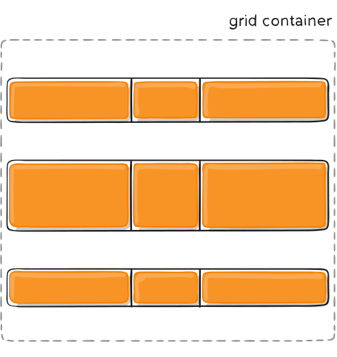

## Objectives:
- Grid Systems
- Responsive Design
## Grid Systems
### Introduction
**CSS Grid** is a powerful tool for creating web page layouts. It works by turning a container into a grid using the `display: grid;` property. Once the container is defined as a grid, the items inside it can be placed in specific rows and columns, allowing for precise control over the layout. This makes it easy to design complex, responsive, and well-organized web pages.
### Container Properties
#### `grid-template-columns`
The **`grid-template-columns`** property allows us to define the number and size of columns in a grid container, giving us full control over the layout structure. The value can be set in the following ways:
1. **Fixed Column Sizes**:
    ```
    grid-template-columns: 100px 200px 175px;
    ```

    This creates three columns: the first column has a fixed width of 100px, the second has a width of 200px, and the third has a width of 175px.
2. **Flexible Column Sizes (using `fr`)**:
    ```
    grid-template-columns: 1fr 2fr 1fr;
    ```
    This creates flexible-sized columns where the second column takes up twice the space of the first and third columns.
3. **Mixed Sizes**:
	```
    grid-template-columns: 100px 1fr 2fr;
	```    
    This creates three columns: the first column has a fixed width of 100px, while the second and third columns share the remaining space. The third column takes up twice the space of the second column.
4. **Repeating Columns**:
    ```
    grid-template-columns: repeat(3, 1fr);
    ```
    This creates three equal-width columns.
5. **Using `minmax(min, max)`**:
	 ```
    grid-template-columns: minmax(100px, 1fr) 2fr;
    ```
    Here, the first column has a minimum width of 100px and can grow up to half the size of the second column, which takes up twice the remaining space.
6. **Auto-Sized Columns**:
   ```
    grid-template-columns: auto 1fr auto;
    ```
    The first and third columns will shrink or grow based on their content, while the second column takes up the remaining space.
#### `grid-template-rows`
The **`grid-template-rows`** property works similarly to **`grid-template-columns`**, but it applies to rows instead of columns. It allows us to define the number and size of rows in a grid container.
1. **Fixed Row Sizes**:
	```
    grid-template-rows: 100px 200px 175px;
    ```
    This creates three rows: the first row has a fixed height of 100px, the second has a height of 200px, and the third has a height of 175px.
2. **Flexible Row Sizes (using `fr`)**:
    ```
    grid-template-rows: 1fr 2fr 1fr;
   ``` 
    This creates flexible-sized rows where the second row takes up twice the space of the first and third rows.
3. **Mixed Sizes**:
    ```
    grid-template-rows: 100px 1fr 2fr;
    ```
    This creates three rows: the first row has a fixed height of 100px, while the second and third rows share the remaining space. The third row takes up twice the space of the second row.
4. **Repeating Rows**:
    ```
    grid-template-rows: repeat(3, 1fr);
    ```
    This creates three equal-height rows.
5. **Using `minmax(min, max)`**:
    ```
    grid-template-rows: minmax(100px, 1fr) 2fr;
    ```
    Here, the first row has a minimum height of 100px and can grow up to half the size of the second row, which takes up twice the remaining space.
    
6. **Auto-Sized Rows**:
	```
    grid-template-rows: auto 1fr auto;
    ```
    The first and third rows will shrink or grow based on their content, while the second row takes up the remaining space.
#### `grid-template-areas`
The **`grid-template-areas`** property allows us to define and organize the layout of a grid container using named areas.  
**Example:**
```
.item-a { 
grid-area: header; 
} 
.item-b { 
grid-area: main; 
} 
.item-c { 
grid-area: sidebar; 
} 
.item-d { 
grid-area: footer; 
} 
.container { 
display: grid; 
grid-template-columns: 50px 50px 50px 50px; 
grid-template-rows: auto; 
grid-template-areas: 
"header header header header" 
"main main . sidebar" 
"footer footer footer footer"; }
```
**Output:**  
  

We can see that we named our items using the **`grid-area`** property and then used **`grid-template-areas`** to position them within our grid.
#### `grid-template`

The **`grid-template`** property is a shorthand in CSS Grid that combines **`grid-template-rows`**, **`grid-template-columns`**, and **`grid-template-areas`** into a single declaration.
```
grid-template: <grid-template-rows> / <grid-template-columns>;
/* or */
grid-template: <grid-template-areas> <grid-template-rows> / <grid-template-columns>;
```

#### `row-gap`, `column-gap` and `gap`
The **`row-gap`** and **`column-gap`** properties allow us to control the spacing between rows and columns in a CSS Grid layout. 
```
.container {
	column-gap: 15px;
	row-gap: 20px;
}
```
The **`gap`** property is a shorthand for **`row-gap`** and **`column-gap`**. It allows us to set both row and column gaps in a single declaration `gap: <row-gap> <column-gap>;`.
```
.container {
	gap: 20px 15px;
}

```
#### `justify-items`
The **`justify-items`** property allows us to control how grid items are aligned horizontally within their respective grid cells. It applies to all items inside the grid container, It accepts the following values:
- **`start`**: Aligns items to the left side of their grid cell.  


- **`end`**: Aligns items to the right side of their grid cell.  
-   

- **`center`**: Centers items horizontally within their grid cell.  


- **`stretch`**: (Default) Stretches items to fill the entire width of their grid cell.  
  


        
#### `align-items`
The **`align-items`** property allows us to control how grid items are aligned vertically within their respective grid cells. It applies to all items inside the grid container, It accepts the following values:
- **`start`**: Aligns items to the top of their grid cell.  
  

- **`end`**: Aligns items to the bottom of their grid cell.  
  

- **`center`**: Centers items vertically within their grid cell.  
  

- **`stretch`**: (Default) Stretches items to fill the entire height of their grid cell.    
  

#### `place-items`
The **`place-items`** property is a shorthand that combines **`align-items`** and **`justify-items`** into a single declaration. It allows us to control both the vertical and horizontal alignment of grid items within their respective cells, making it a convenient way to set default alignment for the entire grid.
```
place-items: <align-items> <justify-items>;
```
If only one value is provided, it applies to both **`align-items`** and **`justify-items`**.
#### `justify-content`
The **`justify-content`** property in CSS Grid allows us to control how the entire grid is aligned horizontally within its container, It accepts the following values:
- **`start`**: Aligns the grid to the left side of the container (default).  
  
  
- **`end`**: Aligns the grid to the right side of the container.  
    
  
- **`center`**: Centers the grid horizontally within the container.  
    
  
- **`stretch`**: Stretches the grid tracks to fill the container's width (if track sizes are not fixed).   
     
  
- **`space-around`**: Distributes equal space around each grid track, with half-sized spaces at the edges.   
     
  
- **`space-between`**: Distributes equal space between grid tracks, with no space at the edges.  
     
  
- **`space-evenly`**: Distributes equal space around and between grid tracks.  
 


#### `align-content`
The **`align-content`** property allows us to control how the entire grid is aligned vertically within its container, It accepts the following values:
- **`start`**: Aligns the grid to the top of the container.  
      
  
- **`end`**: Aligns the grid to the bottom of the container.  
    
  
- **`center`**: Centers the grid vertically within the container.  
    
    
- **`stretch`**: Stretches the grid tracks to fill the container's height (if track sizes are not fixed).  
    
  
- **`space-around`**: Distributes equal space around each grid track, with half-sized spaces at the edges.  
    
  
- **`space-between`**: Distributes equal space between grid tracks, with no space at the edges.  
     
  
- **`space-evenly`**: Distributes equal space around and between grid tracks. 

 
#### `place-content`
The **`place-content`** property is a shorthand that combines **`align-content`** and **`justify-content`** into a single declaration. It allows us to control both the vertical and horizontal alignment of the entire grid within its container, making it a convenient way to set default alignment for the grid as a whole.
```
place-content: <align-content> <justify-content>;
```
If only one value is provided, it applies to both **`align-content`** and **`justify-content`**.
#### `grid-auto-columns` and `grid-auto-rows`
We use the **`grid-auto-columns`** and **`grid-auto-rows`** properties to define the size of columns and rows that are added **implicitly** (automatically) as users interact with our webpages. These properties ensure that any dynamically added content fits seamlessly into the grid layout, maintaining a consistent and visually appealing design.  
They accept the same values as **`grid-template-rows`** and **`grid-template-columns`**
#### `grid-auto-flow`
The **`grid-auto-flow`** property controls how grid items are placed in the grid when they are not explicitly positioned. It determines the direction and order in which items are added to the grid,It acceptes the following values:
- **`row`**: (Default) Items are placed row by row, filling each row before moving to the next.
- **`column`**: Items are placed column by column, filling each column before moving to the next.
- **`row dense`**: Items are placed row by row, and the algorithm attempts to fill gaps in the grid by moving smaller items forward.
- **`column dense`**: Items are placed column by column, and the algorithm attempts to fill gaps in the grid by moving smaller items forward.
### Cells Properties
#### ``grid-column-start`` and ``grid-column-end``
The **`grid-column-start`** and **`grid-column-end`** properties allow us to control where a grid item starts and ends within the grid columns., They accepts the following values
- **`<line-number>`**: Refers to the grid line number (e.g., `1`, `2`, `3`).
- **`<line-name>`**: Refers to a named grid line (if defined in `grid-template-columns`).
- **`span <number>`**: Spans the item across a specified number of columns.
- **`span <name>`**: Spans the item until a named grid line is reached.
- **`auto`**: Lets the grid automatically place the item.  

**Examples :**  
1. **Spanning Specific Columns**:
	```
    grid-column-start: 1;
    grid-column-end: 3;
    ```
	The item starts at column line 1 and ends at column line 3, spanning 2 columns.
2. **Using `span`**:
    ```
    grid-column-start: 2;
    grid-column-end: span 2;
    ```
	The item starts at column line 2 and spans 2 columns.
3. **Named Grid Lines**:
	 ```
    grid-column-start: sidebar-start;
    grid-column-end: main-end;
    ```
    The item starts at the `sidebar-start` line and ends at the `main-end` line (if these lines are defined in `grid-template-columns`).
4. **Automatic Placement**:
    ```
    grid-column-start: auto;
    grid-column-end: auto;
    ```

We can use the shorthand **`grid-column`** to combine **`grid-column-start`** and **`grid-column-end`** into a single declaration.`grid-column: <start-line> / <end-line>;`  
**Example:**  
- **Spanning Specific Columns**:
	 ```
    grid-column: 1 / 3;
	```
	The item starts at column line 1 and ends at column line 3, spanning 2 columns.    
- **Using `span`**:
    
    ```
    grid-column: 2 / span 2;
    ```
     The item starts at column line 2 and spans 2 columns.  
- **Named Grid Lines**:
	```
    grid-column: sidebar-start / main-end;
    ```
     The item starts at the `sidebar-start` line and ends at the `main-end` line (if these lines are defined in `grid-template-columns`).
- **Automatic Placement**:
	```
    grid-column: auto;
    ```
     The grid automatically places the item in the next available column.

#### ``grid-row-start`` and ``grid-row-end``
The **`grid-row-start`** and **`grid-row-end`** properties allow us to control where a grid item starts and ends within the grid rows. They accept the following values:
- **`<line-number>`**: Refers to the grid line number (e.g., `1`, `2`, `3`).
- **`<line-name>`**: Refers to a named grid line (if defined in `grid-template-rows`).
- **`span <number>`**: Spans the item across a specified number of rows.
- **`span <name>`**: Spans the item until a named grid line is reached.
- **`auto`**: Lets the grid automatically place the item.  
**Examples:**  
1. **Spanning Specific Rows**:
	```
    grid-row-start: 1;
    grid-row-end: 3;
    ```
     The item starts at row line 1 and ends at row line 3, spanning 2 rows.
2. **Using `span`**:
    ```
    grid-row-start: 2;
    grid-row-end: span 2;
    ```
     The item starts at row line 2 and spans 2 rows.  
3. **Named Grid Lines**:
    ```
    grid-row-start: header-start;
    grid-row-end: footer-end;
    ```
     The item starts at the `header-start` line and ends at the `footer-end` line (if these lines are defined in `grid-template-rows`).     
4. **Automatic Placement**:
    ```
    grid-row-start: auto;
    grid-row-end: auto;
    ```
     The grid automatically places the item in the next available row.   

We can use the shorthand **`grid-row`** to combine **`grid-row-start`** and **`grid-row-end`** into a single declaration: ``grid-row: <start-line> / <end-line>;``  
**Examples:**  
- **Spanning Specific Rows**:
    ```
    grid-row: 1 / 3;
    ```
     The item starts at row line 1 and ends at row line 3, spanning 2 rows.  
- **Using `span`**:
    ```
    grid-row: 2 / span 2;
    ```
     The item starts at row line 2 and spans 2 rows.    
- **Named Grid Lines**:  
    ```
    grid-row: header-start / footer-end;
    ```
     The item starts at the `header-start` line and ends at the `footer-end` line (if these lines are defined in `grid-template-rows`).   
- **Automatic Placement**:
    ```
    grid-row: auto;
    ```
     The grid automatically places the item in the next available row.
#### ``grid-area``
The **`grid-area`** property is a shorthand that allows us to define both the position and size of a grid item within the grid. It combines **`grid-row-start`**, **`grid-column-start`**, **`grid-row-end`**, and **`grid-column-end`** into a single declaration. Additionally, it can be used to assign a grid item to a named area defined in **`grid-template-areas`**.  
**Syntax:**
```
grid-area: <row-start> / <column-start> / <row-end> / <column-end>;
```
Or  
```
grid-area: <area-name>;
```
#### `justify-self` and `align-self`
The **`justify-self`** and **`align-self`** properties allow us to control the alignment of an individual grid item within its grid cell. These properties override the default alignment set by **`justify-items`** and **`align-items`** on the grid container.  
**`justify-self`**:
This property aligns the item **horizontally** within its grid cell. It accepts the following values:
- **`start`**: Aligns the item to the left side of the cell.
- **`end`**: Aligns the item to the right side of the cell.
- **`center`**: Centers the item horizontally within the cell.
- **`stretch`**: (Default) Stretches the item to fill the width of the cell.   

**`align-self`**:
This property aligns the item **vertically** within its grid cell,It accepts the following values:
- **`start`**: Aligns the item to the top of the cell.
- **`end`**: Aligns the item to the bottom of the cell.
- **`center`**: Centers the item vertically within the cell.
- **`stretch`**: (Default) Stretches the item to fill the height of the cell.   
 
We can use The **`place-self`** property as shorthand that combines **`align-self`** and **`justify-self`** into a single declaration. It allows us to control both the vertical and horizontal alignment of an individual grid item within its grid cell.
**Syntax:**
```
place-self: <align-self> <justify-self>;
```
 If only one value is provided, it applies to both **`align-self`** and **`justify-self`**.
## Responsive Design
### Introduction
When creating webpages, our goal is always to target the largest audience possible. However, this can present a challenge due to the variety of devices people use to access our content. Some visitors may use a desktop computer, while others may browse on their phones, tablets, or even smart TVs. Creating the same layout for all devices is not ideal because screen sizes vary significantly. For example, the amount of information that fits on a large desktop screen may not work well on a smaller mobile screen.  
To address this issue, CSS provides a powerful tool called **media queries**. Media queries allow us to create different layouts and styles tailored to specific devices or screen sizes. This ensures that our content is displayed optimally across all platforms.  
A common approach is to start by designing the layout for mobile devices first. This is because the majority of web traffic now comes from mobile devices, making it more likely that visitors will access your site on their phones. Once the mobile layout is established, we can use media queries to adapt the design for larger screens, such as tablets, desktops, and TVs. By doing this, we ensure a seamless and user-friendly experience for all visitors, regardless of the device they use.
### Media Queries:
We use **media queries** to create responsive designs that adapt to different screen sizes. To implement this, the first step is to set the **viewport** by adding the viewport meta tag in the `<head>` section of your HTML page. This ensures that the page is properly scaled and rendered on various devices.
```
<meta name="viewport" content="width=device-width, initial-scale=1.0">
```
After setting the viewport, the next step is to style and create the layout for our page, starting with a **base design** tailored to a specific target device size (e.g., mobile-first or desktop-first). Once the base style is complete, we can use **media queries** to adapt the design for other screen sizes.  
Inside a media query, we can specify the screen size we’re targeting using properties like `min-width`, `max-width`, `min-height`, and `max-height`. Here’s how it works:
- **`min-width`**: Applies styles when the screen width is **greater than or equal to** the specified value.
- **`max-width`**: Applies styles when the screen width is **less than or equal to** the specified value.
- **`min-height`**: Applies styles when the screen height is **greater than or equal to** the specified value.
- **`max-height`**: Applies styles when the screen height is **less than or equal to** the specified value.
#### Example:
**HTML:**
```
<!DOCTYPE html>
<html lang="en">
<head>
    <meta charset="UTF-8">
    <meta name="viewport" content="width=device-width, initial-scale=1.0">
    <title>Responsive Grid Example</title>
    <link rel="stylesheet" href="styles.css">
</head>
<body>
    <div class="grid-container">
        <div class="item">Item 1</div>
        <div class="item">Item 2</div>
        <div class="item">Item 3</div>
        <div class="item">Item 4</div>
    </div>
</body>
</html>
```
**CSS:**
```
.grid-container {
    display: grid;
    gap: 10px;
    padding: 10px;
}

.item {
    background-color: #4CAF50;
    color: white;
    text-align: center;
    padding: 20px;
    font-size: 1.2rem;
    border-radius: 5px;
}

@media (min-width: 600px) {
    .grid-container {
        grid-template-columns: repeat(2, 1fr); /* 2 columns */
    }
}
@media (min-width: 900px) {
    .grid-container {
        grid-template-columns: repeat(4, 1fr); /* 4 columns */
    }
}
```
**Output:**  


With **media queries**, we can also define specific styles for printing a webpage. This is particularly useful for ensuring that the printed version of the page is clean, readable, and free of unnecessary elements like navigation menus, ads, or background images.  
```
@media print {
/*
Here Style
*/
}
```
### Best Practices:
#### Mobile First
When creating responsive layouts, we should always start by designing and building for mobile devices first. This approach, known as **mobile-first design**, ensures that the core content and functionality are optimized for smaller screens, which often have limited space and resources. Once the mobile layout is complete, we can then use **media queries** to enhance the design for larger screens, such as tablets and desktops.
#### Using Grids
CSS Grid allows us to **position and arrange elements** in a flexible and precise way, making it essential for creating **responsive designs**. With Grid, we can easily define rows and columns, control spacing, and align content, all while ensuring our layout adapts seamlessly to different screen sizes. Additionally, Grid provides the powerful **grid template areas** feature, which allows us to visually map out and name sections of our layout, making it even easier to create complex designs.  
When using CSS Grid, changing the layout for different devices often requires only **small adjustments** with media queries. This is because Grid’s flexible units (like `fr` and `auto`) and features (like `auto-fit` and `minmax()`) handle much of the responsiveness automatically. For example, with **grid template areas**, we can define different layouts for various screen sizes simply by rearranging named areas, reducing the need for extensive code changes.
#### Using Responsive Units
When creating a responsive design, it is better to use **responsive units** (such as `%`, `em`, `rem`, `vw`, and `vh`) instead of fixed units (like `px`). Unlike fixed units, responsive units scale and adapt to different screen sizes, making them ideal for creating flexible and adaptable layouts. These units can also scale relative to the **viewport** or parent elements, ensuring that your design looks great on all devices.
#### Using `max-height`, `min-height`, `max-width`, and `min-width` in Responsive Design
These CSS properties allow us to set boundaries for how large or small an element can be, ensuring that it behaves predictably across different screen sizes.
 1. **`max-width`**: The `max-width` property sets the **maximum width** an element can have. If the element’s content is smaller, it will shrink to fit. This is particularly useful for preventing elements from becoming too large on wider screens.
2. **`min-width`**: The `min-width` property sets the **minimum width** an element can have. If the element’s content is larger, it will expand to fit. This is useful for ensuring elements don’t become too small on narrower screens.
3. **`max-height`** The `max-height` property sets the **maximum height** an element can have. If the element’s content is smaller, it will shrink to fit. This is useful for controlling the height of elements like modals or images.
4. **`min-height`**: The `min-height` property sets the **minimum height** an element can have. If the element’s content is larger, it will expand to fit. This is useful for ensuring elements maintain a minimum height, even if their content is small.
## Task
Create a responsive restaurant website using **CSS Grid** for layout and **Flexbox** for alignment. The website should adapt to different screen sizes (mobile, tablet, desktop) and include key sections for a restaurant business.
#### Website Sections
Your restaurant website must include the following sections:
1. **Header & Navigation**
	- Restaurant name/logo
	- Navigation menu (Home, Menu, About, Contact)
	- **Mobile-friendly**: Hamburger menu on small screens
2. **Hero Section**
	- Large background image with overlay
	- Call-to-action button (e.g., "View Menu")
	- Centered text using **Flexbox**
3. **Featured Dishes**
	- Grid layout showing 6 dishes
	- Each dish card includes:
	    - Image
	    - Name
	    - Short description
	- **Responsive behavior**:
	    - Mobile: 1 column
	    - Tablet: 2 columns
	    - Desktop: 3 columns
 4. **Menu Section**
	- Grid layout for food items
	- Each item includes:
	    - Image
	    - Name
	    - Price
	    - "Add to Cart" button  
	- Responsive behavior:
	    - Mobile: 1 column
	    - Tablet: 2 columns
	    - Desktop: 3 columns
 5. **Contact Section**
	- Contact form (Name, Email, Message)
	- Embedded Google Map
	- **Responsive behavior**:
	    - Mobile: Form and map stacked
	    - Desktop: Side-by-side
6. **Footer**
	- Opening hours
	- Social media links
	- Copyright information
#### Solution:
You can find our solution here: https://alitigui.github.io/Front_end_solutions/Lecture6/solution/index.html
