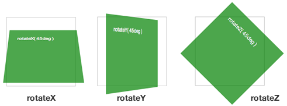
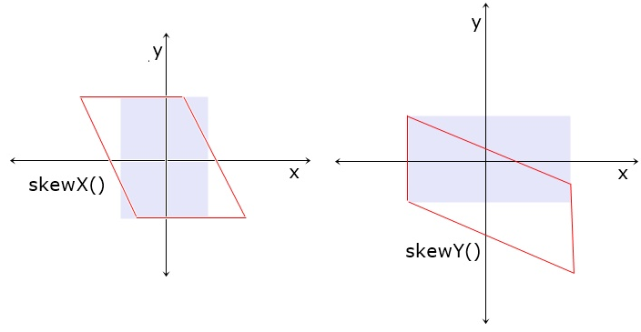

## Objectives
- Transform and Transform3D
- Transitions and Animations
## Transform
### Introduction
The **`transform`** property in CSS allows us to apply various transformations to elements, such as rotating, scaling, skewing, and translating (moving) them. This property enables both **2D** and **3D transformations**.
### Transfomr axis
When using the **`transform`** property in CSS, transformations are applied based on the three primary axes: **X**, **Y**, and **Z**. These axes define the direction in which an element is transformed.
1. **X-axis**: Represents the **horizontal axis**. Positive values move the element to the right, while negative values move it to the left.
2. **Y-axis**: Represents the **vertical axis**. Positive values move the element downward, while negative values move it upward.
3. **Z-axis**: Represents the **depth axis**, which is perpendicular to the screen. Positive values bring the element closer to the user, while negative values push it farther away. This axis is essential for creating **3D transformations**.  

  

### Perspective
We’ve seen how to create 2D transformations and 3D transformations using CSS. In 2D space, the **X and Y axes** are defined by the **width** and **height** of the container or the page. However, for 3D transformations, we also need to define the **depth** along the **Z-axis**. To set that we use the **`perspective` property**. 
The **`perspective` property** creates a **3D space** by defining the distance between the viewer and the z=0 plane, the larger the value we set for the `perspective` property, the subtler the 3D effect becomes, as if the viewer is farther away from the object. Conversely, a smaller value (e.g., `300px`) makes the 3D effect more pronounced, as if the viewer is closer to the object.
### Transform Style
The **`transform-style` property** in CSS is used to determine how child elements are rendered in **3D space**. It specifies whether the children of an element are positioned in the **3D space** or flattened into the **2D plane** of the parent element.
- **`flat`**  The hild elements are flattened into the **2D plane** of the parentm that mean ny 3D transformations applied to the children will not retain their depth.  
- **`preserve-3d`**:The  Child elements are rendered in 3D space, This allows nested elements to maintain their depth and interact with 3D transformations.
### Rotate
The **`rotate` function** allows us to rotate an element by a specific degree around one of the three axes: **X**, **Y**, or **Z**. 
- **`rotateX(angle)`**: Rotates the element around the **X-axis** (horizontal axis). 
- **`rotateY(angle)`**: Rotates the element around the **Y-axis** (vertical axis). 
- **`rotateZ(angle)`**: Rotates the element around the **Z-axis** (depth axis). 
#### Example
```
div {
  transform: rotateZ(180deg);
}
```
This will rotate the **`div`** **180 degrees** around the **Z-axis**  
  

### Scale
The **`scale` function** in CSS allows us to resize an element by a specific ratio. We can scale its **width**, **height**, or **both dimensions** simultaneously. 
- If **we** want to scale both the width and height by the **same ratio**, **we** can pass a **single value** to the `scale` function. This value will be applied to both dimensions.
 ```
 transform: scale(1.5);
```
- If **we** want to scale the width and height by **different ratios**, **we** can pass **two values** to the `scale` function. The **first value** scales the width, and the **second value** scales the height.
```
transform: scale(1.2, 0.8); /
```
- If **we** want to scale **only the width**, **we** can use the `scaleX` function.
```
transform: scaleX(2); 

```
- If **we** want to scale **only the height**, **we** can use the `scaleY` function.
```
transform: scaleY(0.5);
```
For **3D scaling**, **we** use the `scale3d` function, The `scale3d` function accepts additional arguments, representing the scaling ratios for the **Z-axis**. Additionally, there’s a separate `scaleZ` function that allows **us** to scale an element specifically along the **Z-axis**.
```
transform: scale3d(1.5, 1.2, 2);
```

  

### Translate
The **`translate` function** in CSS allows **us** to move an element along the **X-axis**, **Y-axis**, or **both axes** simultaneously.
- If **we** want to move an element along both the **X-axis** and **Y-axis**, **we** can pass **two values** to the `translate` function. The **first value** moves the element horizontally (X-axis), and the **second value** moves it vertically (Y-axis).
```
transform: translate(50px, 20px);
```
- If **we** want to move an element **only horizontally**, **we** can use the `translateX` function.
```
transform: translateX(100px);
```
-  If **we** want to move an element **only vertically**, **we** can use the `translateY` function.
```
transform: translateY(-30px);
```
For 3D Translation We can use the `translate3d` function to move an element along the **X-axis**, **Y-axis**, and **Z-axis** simultaneously. The `translate3d` function accepts **three arguments**:
- **First value**: Movement along the **X-axis**.
- **Second value**: Movement along the **Y-axis**.
- **Third value**: Movement along the **Z-axis** (depth).
We can set the translation along the Z-axis alone using **`translateZ`**.  
  
 
### Skrew
The **`skew` function** allows **us** to tilt or slant an element along the **X-axis**, **Y-axis**, or **both axes** simultaneously.
- If **we** want to tilt an element along both the **X-axis** and **Y-axis**, **we** can pass **two values** to the `skew` function. The **first value** tilts the element horizontally (X-axis), and the **second value** tilts it vertically (Y-axis).
```
transform: skew(20deg, -15deg);
```
- If **we** want to tilt an element **only horizontally**, **we** can use the `skewX` function.
```
transform: skewX(20deg);
```
- If **we** want to tilt an element **only vertically**, **we** can use the `skewY` function.
```
transform: skewY(-15deg);
```
    

## Transitions and Animations
### Introduction
CSS allows us to apply transformations and modify the style of elements based on their states, such as when they are clicked, hovered, or focused. However, these style changes occur instantly by default. For example, if we translate an element when it is clicked or change its background and size when a user hovers over it, the changes happen abruptly. This can result in a poor user experience, as sudden transitions can feel jarring and unnatural. To address this, CSS provides tools like **transitions** and **animations** that enable us to create smooth, gradual changes between styles.
### Transition
**Transitions in CSS** help us create smooth transformations of an element's style. To make a transition, we first select the element we want to apply the transition to, and then we add the following properties:
1. `transition-property`: Specifies the CSS properties to which the transition effect should be applied (e.g., `background-color`, `opacity`, `transform`).
2. `transition-duration`: Defines how long the transition lasts (e.g., `1s`, `500ms`).
3. `transition-timing-function`: Specifies the speed curve of the transition (e.g., `ease`, `linear`, `ease-in-out`).
	- **`ease`**: The default value. The transition starts slowly, accelerates in the middle, and slows down at the end. This is the most commonly used timing function.
	- **`linear`**: The transition occurs at a constant speed from start to end. There is no acceleration or deceleration.
	- **`ease-in`**: The transition starts slowly and accelerates as it progresses.
	- **`ease-out`**: The transition starts quickly and slows down as it progresses.
	- **`cubic-bezier(n, n, n, n)`**: Allows us to define a custom speed curve using a cubic Bézier function. The four values represent control points for the curve, enabling highly customized timing effects.
	- **`steps(n, start|end)`**: Divides the transition into a specified number of steps, creating a "staircase" effect. The second parameter (`start` or `end`) determines whether the change happens at the beginning or end of each step.
4. `transition-delay`: Adds a delay before the transition starts (e.g., `0.5s`).

**Example**  
**HTML**
```
<div class="box"></div>
```
**CSS**
```
    .box {
      width: 150px;
      height: 150px;
      background-color: blue;
      border-radius: 10px;
      margin: 50px auto;
      transition-property: background-color, transform, opacity;
      transition-duration: 1s, 0.5s, 2s;
      transition-timing-function: ease-in-out, linear, ease;
      transition-delay: 0.2s, 0s, 0.5s;
    }

    .box:hover {
      background-color: red; 
      transform: rotate(45deg) scale(1.2);
      opacity: 0.7;
    }
```
**Explanation**  
In this example, we created a smooth transition effect for a box element using CSS transitions.  
First, we specified the properties we wanted to animate by using the `transition-property` property. In this case, we chose `background-color`, `transform`, and `opacity`, ensuring that these properties would change when the user hovers over the box.   
Next, we defined how long each transition should last using the `transition-duration` property. For the `background-color`, we set a duration of `1s`, while for the `transform` property, we used a shorter duration of `0.5s`, and for the `opacity`, we made the transition last `2s`.  
To control the speed curve of the transitions, we applied different timing functions with the `transition-timing-function` property. For the `background-color`, we used `ease-in-out`, which makes the transition start and end slowly. For the `transform` property, we chose `linear`, which keeps the animation at a constant speed, and for the `opacity`, we applied `ease`, which starts slowly, accelerates, and then slows down.   
Finally, we added delays to some of the transitions using the `transition-delay` property to create a staggered effect. For the `background-color`, we set a delay of `0.2s`, meaning the color change starts slightly after the hover begins. The `transform` property has no delay (`0s`), so it starts immediately, while for the `opacity`, we added a delay of `0.5s`, making it start halfway through the other transitions. 
#### Using `transition`
We can combine all the previous properties into a single shorthand property called `transition`. This shorthand allows us to define the `transition-property`, `transition-duration`, `transition-timing-function`, and `transition-delay` in one line. The values are provided in the following order:
```
transition: [property] [duration] [timing-function] [delay];
```
**Example:**  
**HTML**
```
  <div class="box"></div>
```
**CSS**
```
    .box {
      width: 150px;
      height: 150px;
      background-color: blue;
      border-radius: 10px;
      margin: 50px auto;
      transition: background-color 1s ease-in-out 0.2s,
                  transform 0.5s linear 0s,
                  opacity 2s ease 0.5s;
    }

    .box:hover {
      background-color: red; 
      transform: rotate(45deg) scale(1.2);
      opacity: 0.7; 
    }
```
### Animation
With CSS, we can do more than just create transitions for element styles—we can also design captivating animations to bring our elements to life. By using the `animation` property, we can define how an element should animate over time. To gain precise control over the animation's behavior, we use the `@keyframes` rule. This allows us to specify the style changes at various points during the animation.
#### Creating Animation
to creat animation in css firstly we need select element that we want to animate then  use the folowing attributes to create our animations
1. `animation-name`: First, we specify the name of the animation so we can later control it inside the `@keyframes`.
2. `animation-duration`: Next, we define how long the animation should take to complete (e.g., `2s`, `500ms`).
3. `animation-timing-function`: We use this property to specify the speed curve of the animation (e.g., `ease`, `linear`, `ease-in-out`).
4. `animation-delay`: We can also add a delay before the animation starts (e.g., `1s`, `0.5s`).
5. `animation-iteration-count`: If we want our animation to repeat more than once, **we use** this property to determine how many times the animation should repeat (e.g., `1`, `infinite`).
6. `animation-direction`: We can use this property to specify whether the animation should play forward, backward, or alternate (e.g., `normal`, `reverse`, `alternate`).
	- **`normal`** (default):  The animation plays **forward** from the beginning (`0%`) to the end (`100%`).  
	- **`reverse`**:  The animation plays **backward** from the end (`100%`) to the beginning (`0%`).  
	- **`alternate`**:  The animation plays **forward first**, then **backward** on the next cycle, and 
	- **`alternate-reverse`**: The animation plays **backward first**, then **forward** on the next cycle, and continues to alternate.
    Example:
7. `animation-fill-mode`: This property defines how styles are applied before and after the animation (e.g., `forwards`, `backwards`, `both`).
	- **`none`** (default):  The element's styles are not affected before or after the animation. The element will return to its original state once the animation ends.  
	- **`forwards`**:  The element retains the styles defined in the last keyframe (`100%`) after the animation ends.  
	- **`backwards`**:  The element applies the styles defined in the first keyframe (`0%`) immediately, even before the animation starts (if there is a delay).  
	- **`both`**:  The element applies the styles from the first keyframe (`0%`) before the animation starts and retains the styles from the last keyframe (`100%`) after the animation ends.
8. `animation-play-state`: Finally, we use this property to control whether the animation is running or paused (e.g., `running`, `paused`).
	- **`running`** (default):  The animation is playing as normal.
	- **`paused`**:  The animation is paused at its current state. It can be resumed from where it was paused.  

We can combine all the animation-related properties into a single **shorthand property** called `animation`. This shorthand allows us to define the `animation-name`, `animation-duration`, `animation-timing-function`, `animation-delay`, `animation-iteration-count`, `animation-direction`, `animation-fill-mode`, and `animation-play-state` in one line. The values are provided as following:
```
animation: [name] [duration] [timing-function] [delay] [iteration-count] [direction] [fill-mode] [play-state];
```
#### @keyframes
After creating an animation and setting its parameters, we can define the frames that the animation will use by using the `@keyframes` rule, We begin by writing `@keyframes` followed by the name of the animation. This name should match the one used in the `animation-name` property. Then Inside the `{}` (curly braces), we use percentages to specify the styles at different points in the animation.For example:
- `0%` represents the **starting point** of the animation.       
- `50%` represents the **midpoint**.       
- `100%` represents the **ending point**.  

Inside each percentage block, we define the styles that the element should have at that specific point in the animation. These styles determine how the element transitions from one state to another.
#### Example 
Bouncing ball    
**HTML**
```
<div class="ball"></div>
```
**CSS**
```
.ball {
  width: 50px;
  height: 50px;
  background-color: red;
  border-radius: 50%;
  animation: bounce 1s ease-in-out infinite alternate;
}

@keyframes bounce {
  0% {
    transform: translateY(0);
  }
  100% {
    transform: translateY(-100px);
  }
}
```
## Task:
Create a responsive portfolio website showcasing your work using modern CSS techniques. Demonstrate your skills in layout design, responsiveness, and visual effects.
#### Requirements
1. **Core Structure**
- Use CSS Grid for main layout with `grid-template-areas`
- Implement Flexbox for component alignment
- Follow mobile-first approach with three breakpoints:
    - Mobile (<768px): Single column
    - Tablet (768-1023px): Two columns
    - Desktop (≥1024px): Multi-column
#### Required Sections
1. **Header**: Logo + responsive navigation (hamburger menu on mobile)
2. **Hero**: Introduction with call-to-action button
3. **Projects**: Responsive grid of work samples
4. **Skills**: Flexbox-based display of abilities
5. **Contact**: Functional form
6. **Footer**: Social links + copyright
#### Visual Enhancements
- Gradient backgrounds
- Smooth hover animations
- Transform effects (scale/rotate)
- Page load animations (optional)
#### Solution:
You can find our solution here: https://alitigui.github.io/Front_end_solutions/Lecture7/solution/index.html
